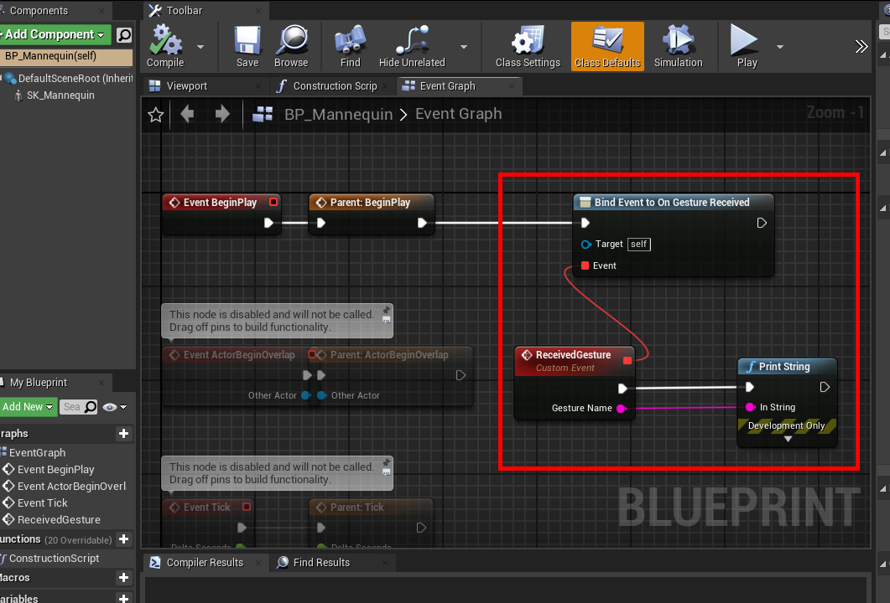
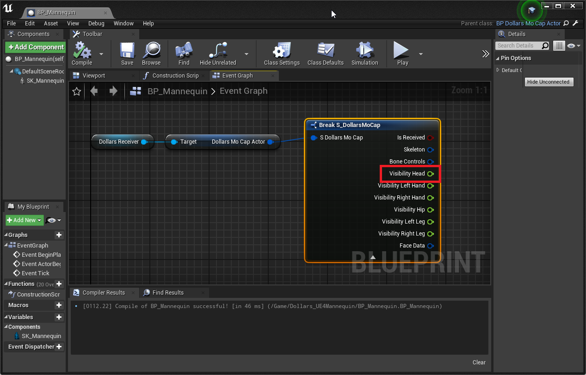
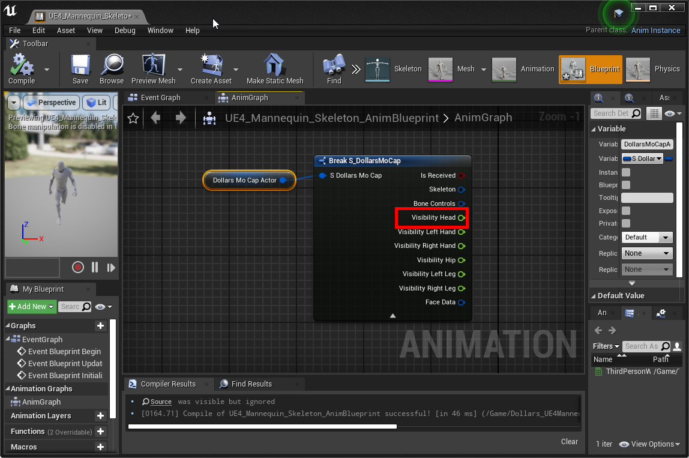

# Using DEEP Lite in Unreal Engine

You need to download the [Unreal Engine plugin](https://kilimanjaro.dollarsmocap.com/DEEP_Lite/Dollars.zip) and the [UE4 Mannequin blueprint](https://kilimanjaro.dollarsmocap.com/DEEP_Lite/Dollars_UE4Mannequin.zip
) compatible with DEEP Lite.

The usage of the plugin is essentially the same as other Dollars products. You can refer to this link for more information.

Here are some differences, using the UE4 Mannequin as an example:

## Setting MoCapActor in the Receiver

If you want to receive gesture recognition messages, in addition to specifying the Dollars Receiver in the character blueprint, you also need to specify the character blueprint in the Dollars Receiver.

## Gesture Recognition

In the character blueprint, you can bind the On Gesture Received message and use the Gesture Name to determine the type of gesture that was triggered.

You can find an example in the downloaded UE4 Mannequin blueprint.

The current Gesture Names are as follows,

- RaiseRightHand
- RaiseLeftHand
- SwipeLeft
- SwipeRight
- Jump

## Tracking Status

You can use the Visibility Head in the DollarsMoCap data structure to determine whether a person is currently being tracked.

When a person is tracked, the value is 1, otherwise, it is 0.

The method to obtain this in the character blueprint is as follows,

Here is how to get it in the animation blueprint,

