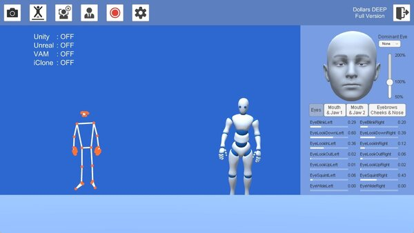
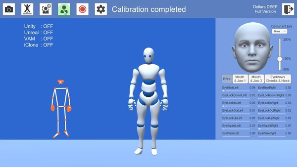

# Calibration

When you launch Dollars DEEP, the motion capture avatar may appear anywhere on the screen depending on the position of your camera.

Before starting motion capture, stand at the center of your mocap area for calibration.

After calibration, the motion capture avatar will be positioned in the center of the screen.

:::info

While calibration, please relax your body, let both hands hang naturally, and look straight ahead.

If you are standing, please ensure that both of your feet can be clearly captured by the camera.

:::

During calibration, the camera will restart several times.

Please keep your calibration pose until the "Calibration complete" message disappears.

Below is a full example of the calibration process.

<iframe width="640" height="360" src="https://www.youtube.com/embed/kUygQ3wZct4?si=sDpNYtTXaEj1lz6t" title="YouTube video player" frameborder="0" allow="accelerometer; autoplay; clipboard-write; encrypted-media; gyroscope; picture-in-picture; web-share" allowfullscreen></iframe>

Calibration is required before each motion capture session or when switching the motion capture actor midway.
