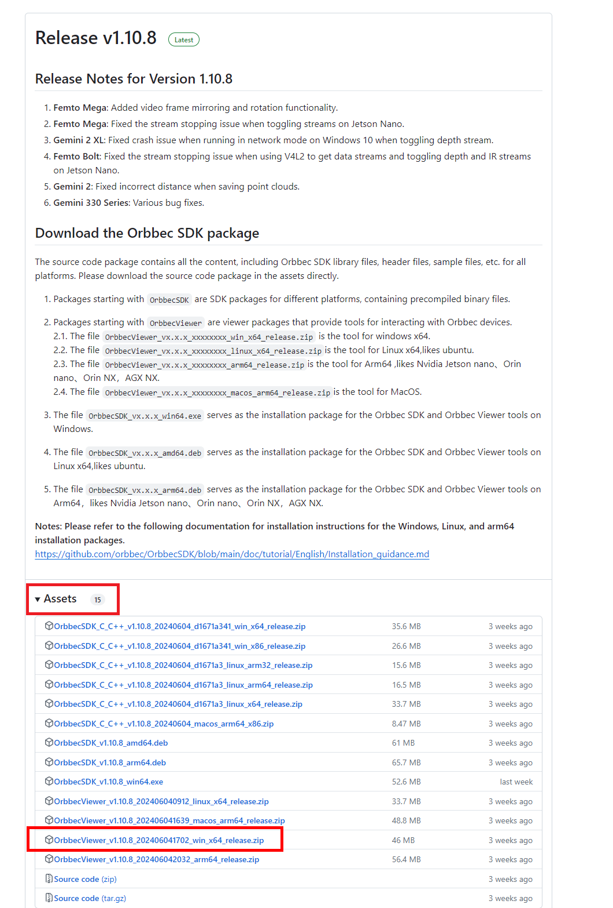
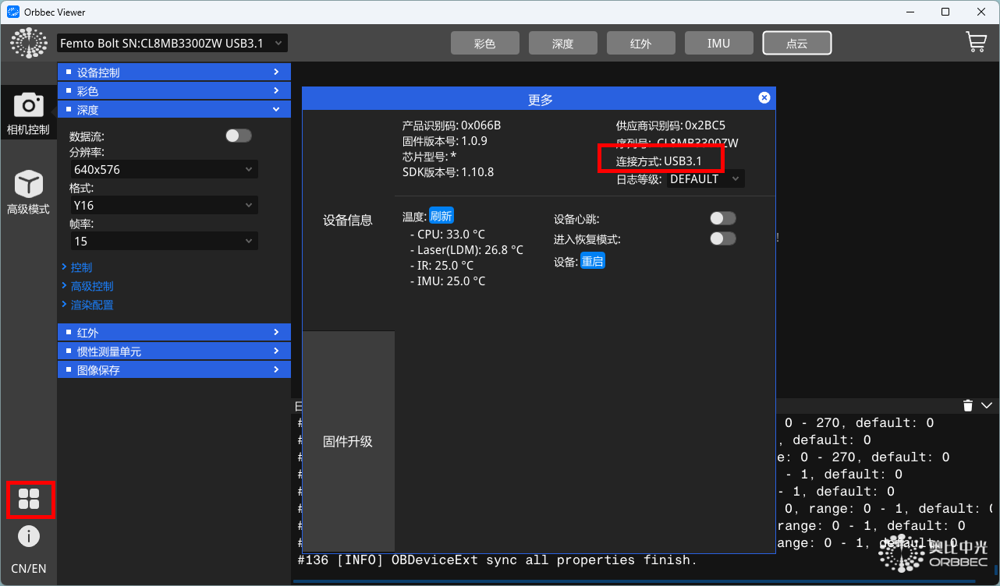
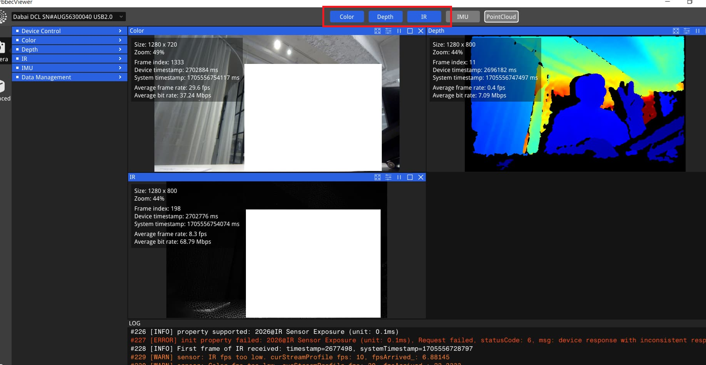
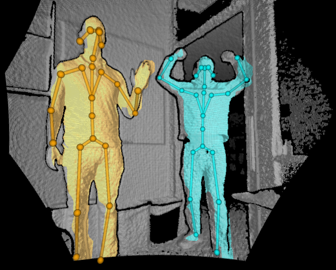

# Connecting Femto Bolt

Before using DEEP, please follow these steps to ensure that Femto Bolt is properly connected and can perform skeletal recognition.

## Ensure Camera is Functioning

Download and run OrbbecViewer.

https://github.com/orbbec/OrbbecSDK/releases

Click on the four squares at the bottom left. In the pop-up dialog, confirm that the connection mode is set to 3.1.

Click the top button to ensure that each camera is outputting correctly.

##  Ensure Skeletal Tracking is Functioning

Download and install the Azure Kinect Body Tracking SDK.

https://github.com/orbbec/Azure-Kinect-Samples/releases/download/body-tracking-bolt-and-mega-bin/body-tracking-bolt-and-mega-bin.zip

(From https://github.com/orbbec/Azure-Kinect-Samples )

After extraction, run Azure Kinect Body Tracking SDK\tools\k4abt_simple_3d_viewer and confirm that skeletal tracking is functioning properly.

