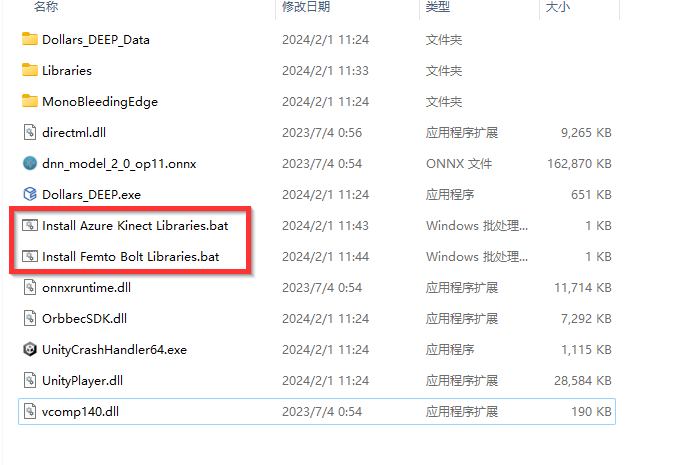

# Switching Runtime Libraries

By default, Dollars DEEP launches with runtime libraries for Azure Kinect. If you are using Femto Bolt, you will need to switch the runtime library to support it. To do this, run the `Install Femto Bolt Libraries.bat` file shown in the image below before starting the program.

when you need to use Azure Kinect, you can run the `Install Azure Kinect Libraries.bat` file to switch to the runtime library that supports Azure Kinect.

:::info
This operation is only necessary the first time you use either Femto Bolt or Azure Kinect.
:::
