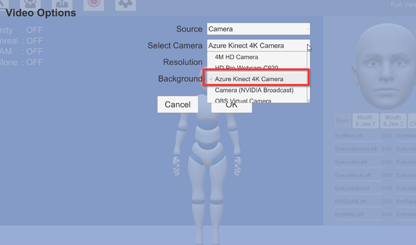
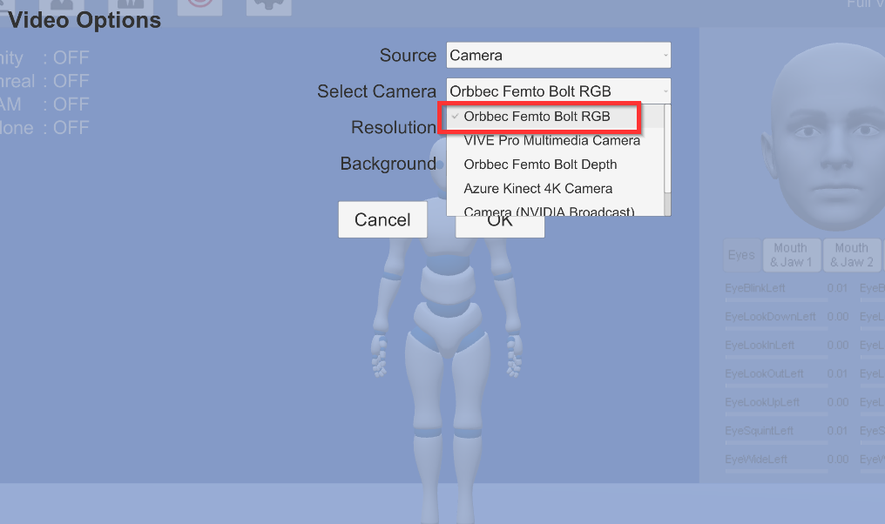
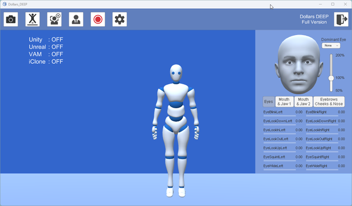
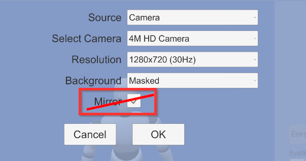

# Camera Placement and Settings

## Orientation

Dollars DEEP currently only supports horizontal mount of the camera, and it's best to avoid any tilt.

## Height and distance

There are no specific requirements for the height and distance of camera placement.

:::danger Important
The goal is to position the camera so that **it captures the actor as large as possible while fully covering the activity area**.
:::

## Selecting the Depth Camera

### Using Azure Kinect

If you are using Azure Kinect, please select 'Azure Kinect' in the Video Options.

### Using Femto Bolt

If you are using Femto Bolt, please select 'Femto Bolt RGB' in the Video Options.

:::danger

Do not select 'Femto Bolt Depth,' as it may cause the program to become unresponsive.

:::

Once the depth camera is selected, the motion capture avatar will change from the usual black,

to azure blue.

:::info
You can verify that the camera has been selected properly by checking if the motion capture avatar has turned blue.
:::

## About Mirror Mode

Dollars DEEP currently does not support the camera mirror mode in Dollars MONO.

