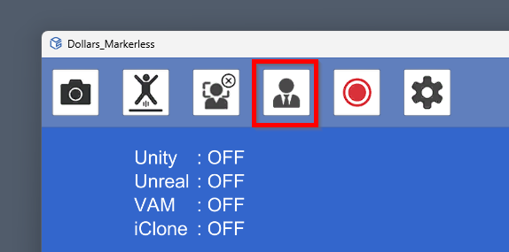

Dollars EGAO provides ARKit-compatible facial expression capture.

Before the capture, it is recommended to relax your facial expression, look straight ahead, and do a calibration.

This will help to improve the accuracy.

## Strength of Facial Expressions

You can control the strength of the facial expressions by using the slider on the right side.

## Dominant Eye

Due to factors such as lighting, angles, image clarity, or wearing glasses during the capture, there may be instances where the eye gaze of both eyes is misrecognized. In such cases, you can ensure synchronized eye gaze by setting a dominant eye.

Please note that setting a dominant eye comes at the cost of not being able to make a crossed-eye expression.

