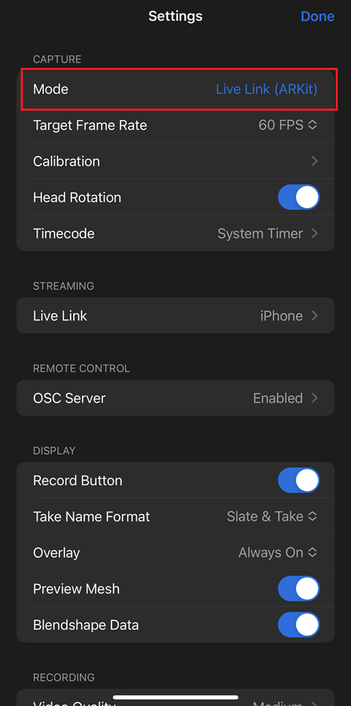
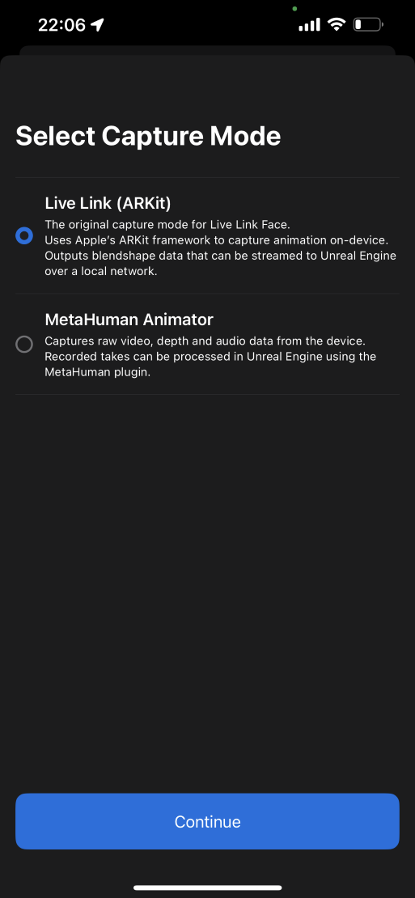
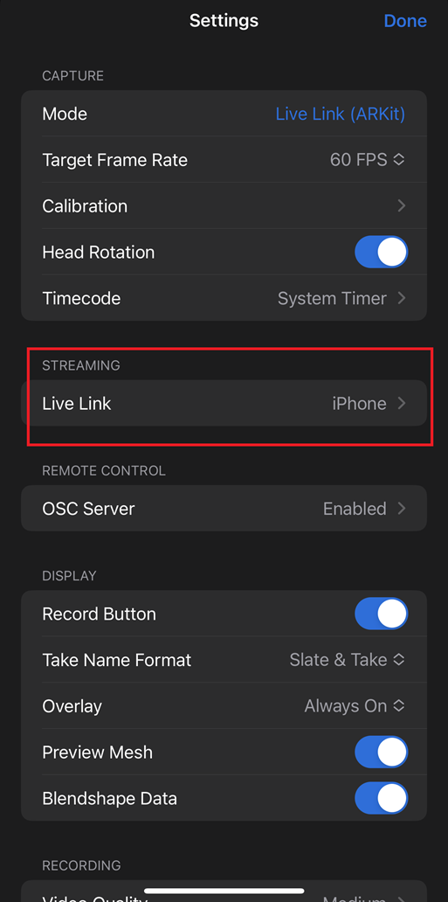
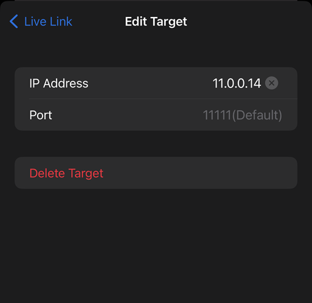
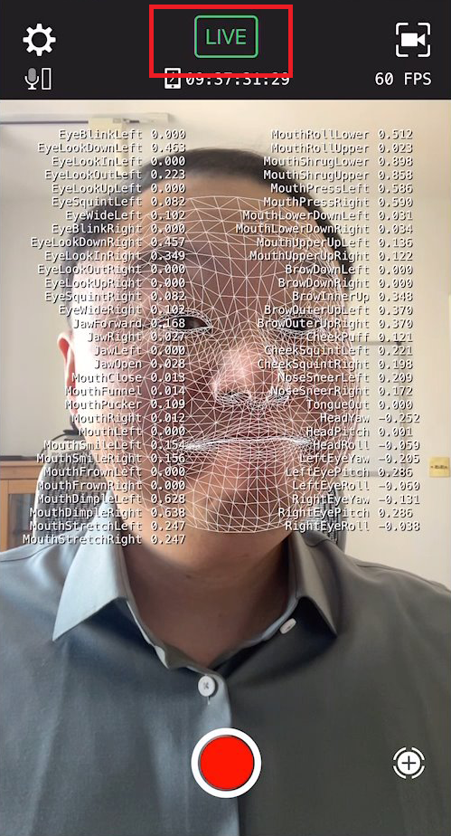
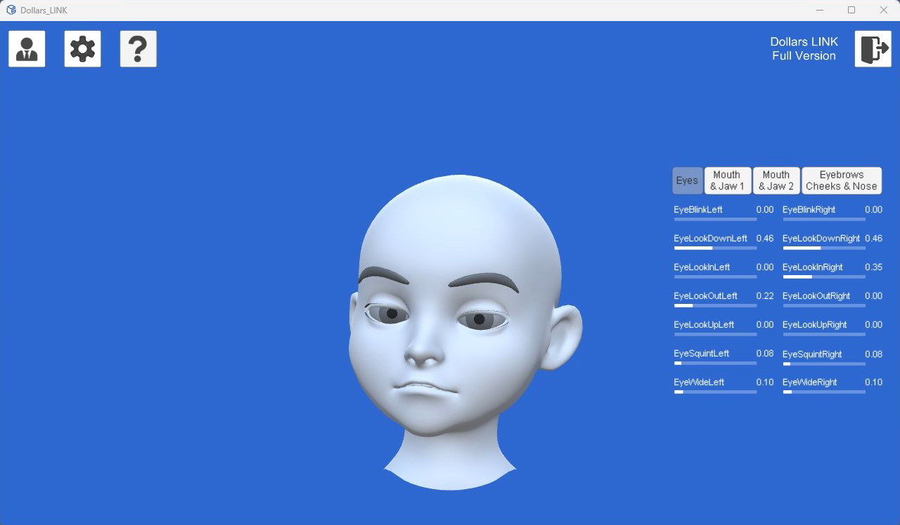

# Get Starteds

You need an iPhone that supports FaceID, and you must install [Live Link Face](https://apps.apple.com/us/app/live-link-face/id1495370836) for facial capture.

## Get Computer's IP

Open Command Prompt on your computer, type ipconfig, and find your LAN IP address.

## Setting Up Live Link Face

### Choose Mode

Open Live Link Face, click the gear icon in the top left corner, and in the Mode options, select Live Link (ARKit).

### Add Streaming Target

In the Streaming options, add a new target.

Enter your computer's IP address. The default port number, 11111, does not need to be changed.

Other options in Live Link Face can remain at their defaults.

## Start Capturing

Press the LIVE box at the top of the Live Link Face main interface to turn it green and begin capturing.

Open Dollars LINK, and you can see the results of facial capture on the avatar.

