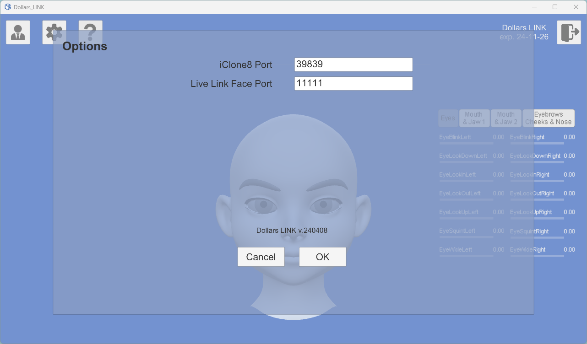

# Connecting to iClone

## Using the iClone Plugin

After confirming that Dollars LINK can receive facial capture data from Live Link Face, you can learn [how to use the Dalle plugin in iClone here](/iClone).

Then, you can perform facial capture in iClone via Live Link Face.

## Modifying the Port

If you need to change the port, you can do so in the options.

