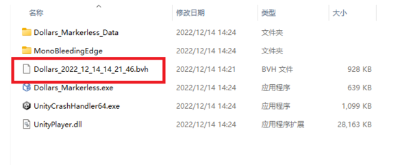

# Recording BVH Files

To start and stop recording a BVH file, simply press the button shown in the image.

:::info

Recording frequency: 30FPS

Estimated size: 5M per minute

:::

The recorded files will be saved in the root directory of the Dollars MONO program, with the current timestamp used as the file name.

