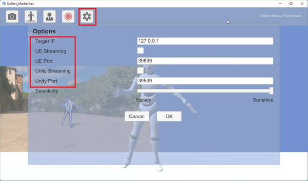
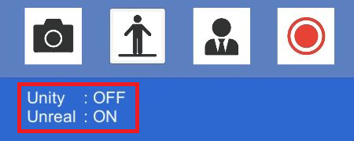

# Stream To Unity & Unreal

You can enable or disable the streaming function in the options dialog.

- - **Target IP:** This is the IP address of the computer where the game engine (Unity or Unreal) is located. If you are using both the motion capture software and the engine on the same computer, leave this as 127.0.0.1.

- **Port:** This is the port that the Dollars MoCap engine plugin is listening on. Using these ports, you can facilitate multi-person motion capture within a single project.
 

After adjusting the streaming settings, the corresponding information will be displayed in the upper left corner of the program.

