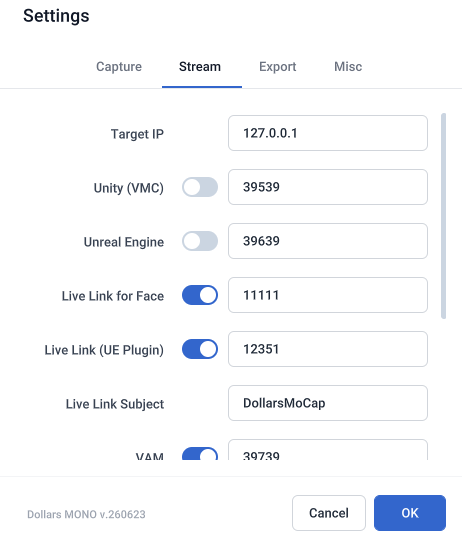
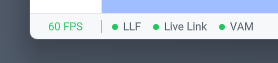
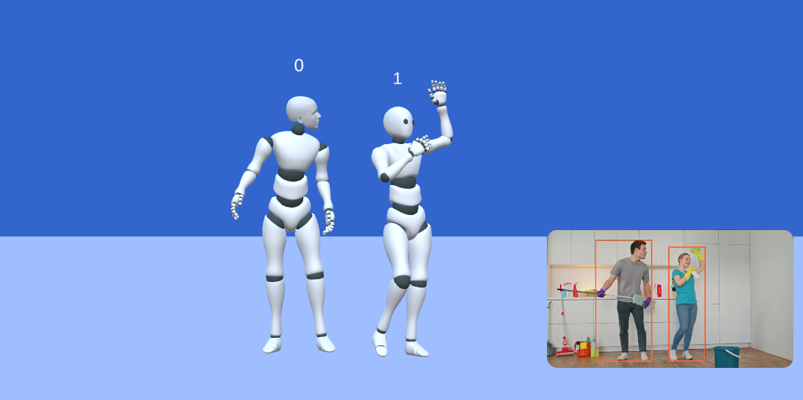

# Stream to Other Applications

## Streaming Settings

You can enable or disable streaming to each engine through the options under Sync Engines.

The Target IP is the IP address of the computer running the engine. If motion capture and the engine run on the same computer, keep the default 127.0.0.1.

The Port is the port that the Dollars MoCap engine plugin listens on.

The currently active streaming options are shown at the bottom left of the program.

## Multi-person Mocap

When multi-person mocap is enabled, a number such as 0 or 1 appears above each avatar.

### UE Live Link Plugin

With the Live Link plugin, you will see up to five Subjects in a single mocap source.

The Subject numbers match those in the mocap program, so select the corresponding Subject to drive each character.

### Other Plugins

With the other plugins, each avatar's motion is streamed on its own port, starting from the configured port and counting up by avatar number.

For example, with the port set to 39639, avatar 0 streams on 39639, avatar 1 on 39640, and so on.

In the third-party program, add a receiver for each of these ports to drive multiple characters at the same time.
