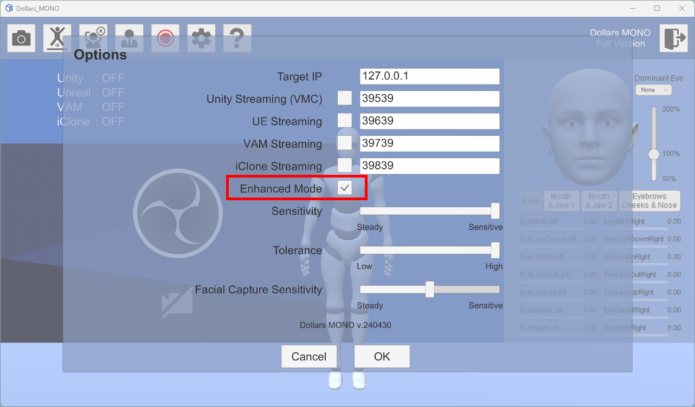
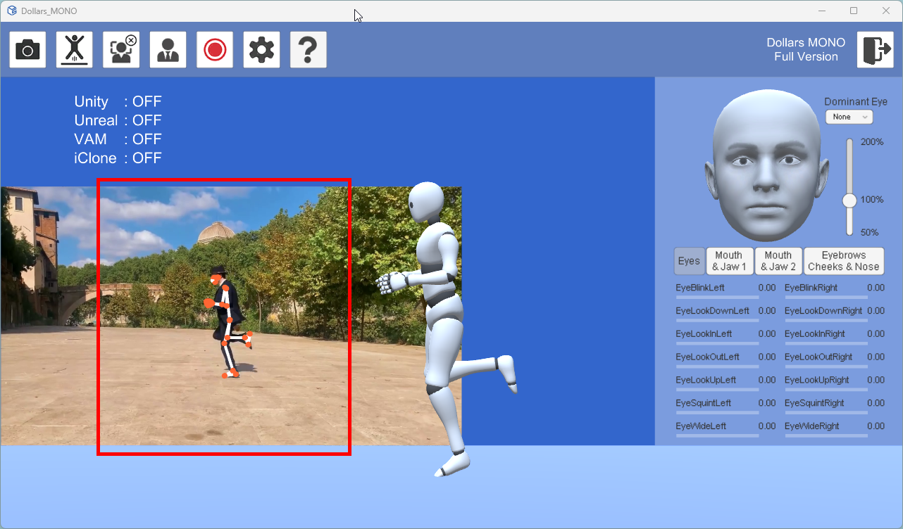

# Enhanced Mode

You can check the "Enhanced Mode" option in the Options window to achieve higher quality motion capture.

Enhanced mode offers improved performance in the following areas,

- More stable tracking of the waist and feet.
- Better overall motion restoration.

Please be aware of the following when using enhanced mode,

- Enhanced mode uses more GPU.
- If there are multiple people in the frame, tracking in enhanced mode may be more prone to interference.
- In landscape mode, the range of motion for the actor is limited. The ideal range is indicated by the red lines in the diagram below.

- 
