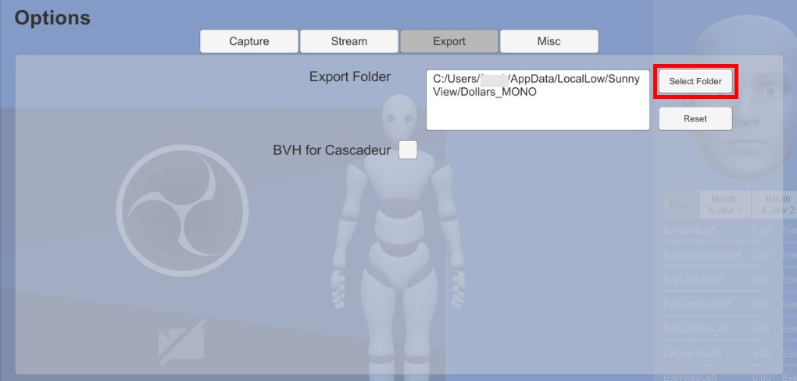

# File Export

You can press the buttons shown in the image below to start and stop exporting motion and facial capture files.


## Export formats

MONO currently supports the following formats,

1. FBX
2. BVH
3. BVH for Cascadeur

FBX supports exporting both motion and facial data, while BVH supports exporting motion data only.

### How to Choose

If you plan to use BVH in iClone or Cartoon Animator, please choose the second format.

If you plan to use BVH in Cascadeur, please choose the third format.

In other cases, you can select any format you prefer.

## File Name and Save Location

Motion files will be named with "Dollars_" followed by a timestamp.

Facial expression files will be named with "Dollars_BS_" followed by a timestamp.

Depending on the operating system, the files will be saved in the following directory.

- - Windows

```C:\Users\[Username]\AppData\LocalLow\SunnyView\Dollars_MONO\```

- MacOS

```/Users/[Username]/Library/Application Support/com.SunnyView.Dollars-MONO```

- Linux

```~/.config/unity3d/SunnyView/Dollars_MONO/```

You can change the export folder in the Options dialog.



By clicking the **Reset** button, you can restore the save location to the default directory above.

Please ensure that the specified target directory has write permission. If MONO fails to save files in the selected directory, they will be saved automatically to the default path listed above.

:::info Note

After changing the save directory, we recommend performing a test recording to confirm that the new location is writable.

:::
