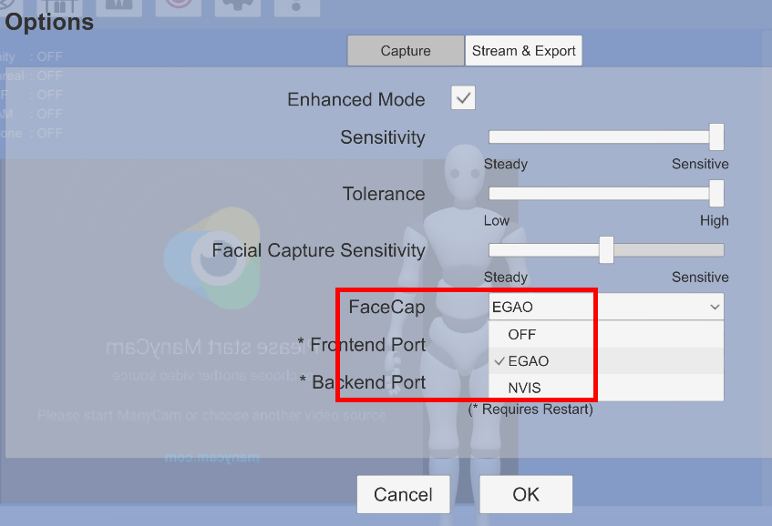
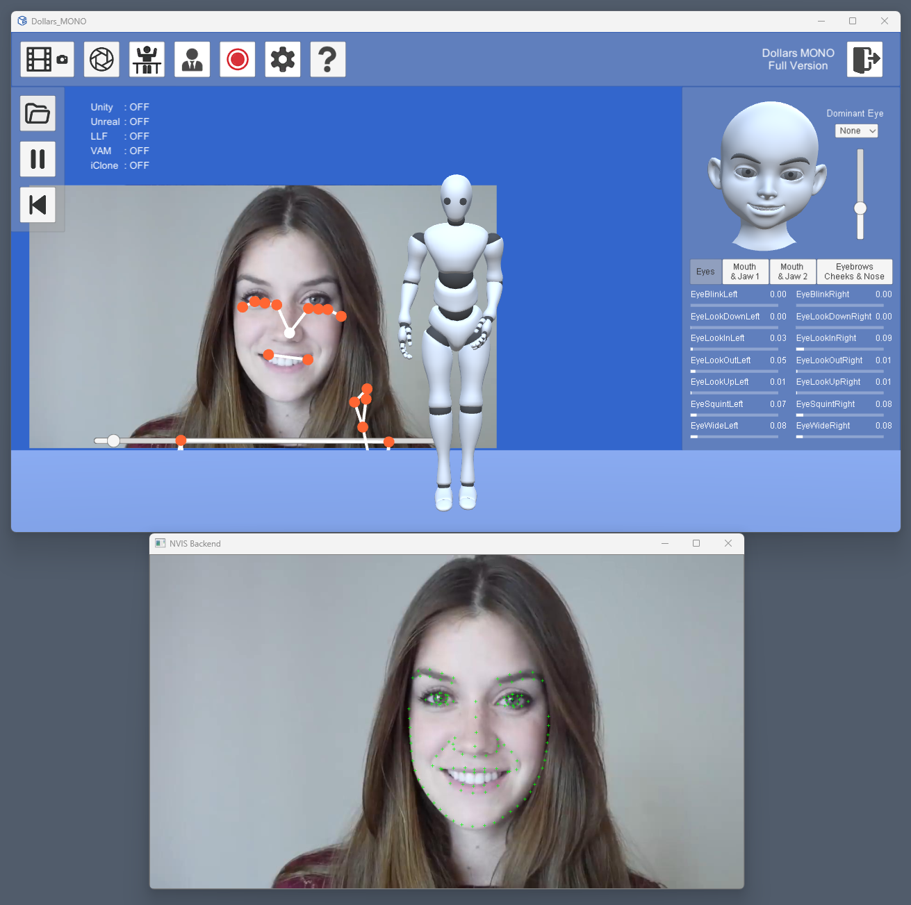

# Facial Capture Modules

Starting from version v.241128, MONO provides two facial capture modules: EGAO and NVIS. You can choose to use either module based on your needs in the settings.

:::warning

The macOS version of MONO currently only supports the EGAO facial capture module.

:::

## EGAO

EGAO is the facial capture module included with MONO since v.230708. It offers basic facial capture with very low system load, making it suitable for lightweight applications.

## NVIS

The NVIS module uses NVIDIA's facial capture technology. With the help of NVIDIA graphics cards, it can provide facial capture quality similar to iPhone-level performance.

Before use, you need to download the appropriate package for your graphics card from the NVIDIA Broadcast Download Center and install it. A system restart is recommended after installation.

https://www.nvidia.com/en-us/geforce/broadcasting/broadcast-sdk/resources/

Once the libraries are properly installed and activated, you will be able to see the NVIS facial capture window besides the MONO program interface.

