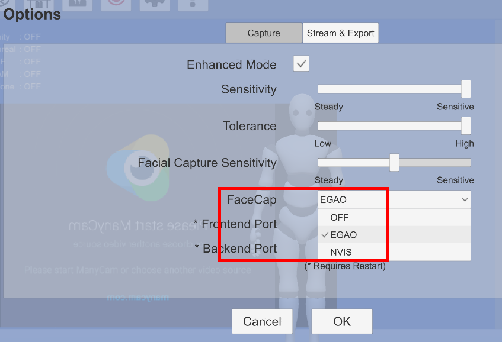

# Facial Capture Modules

Starting from version v.241128, MONO provides two facial capture modules: EGAO and NVIS. You can choose to use either module based on your needs in the settings.

:::warning

The macOS and Linux versions of MONO currently only support the EGAO facial capture module.

:::

## EGAO

EGAO is the facial capture module included with MONO since v.230708. It offers basic facial capture with very low system load, making it suitable for lightweight applications.

## NVIS

The NVIS module can provide facial capture quality close to iPhone-level performance.
