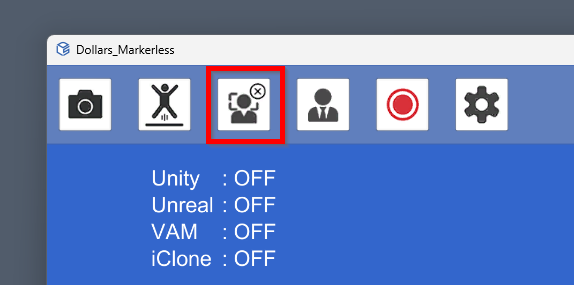
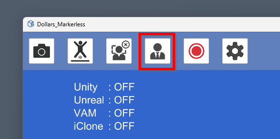
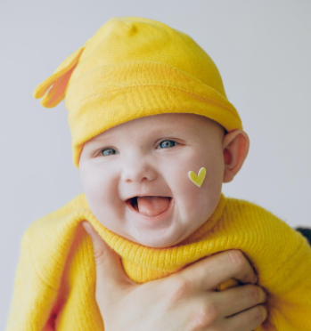
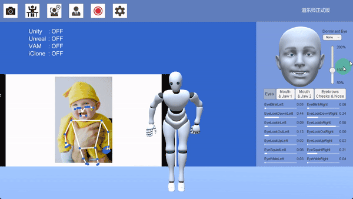
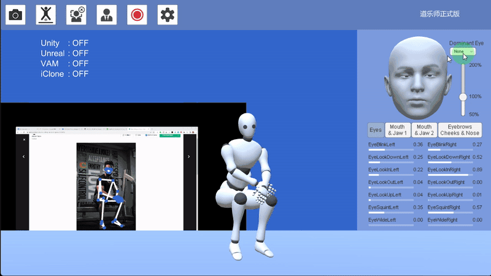
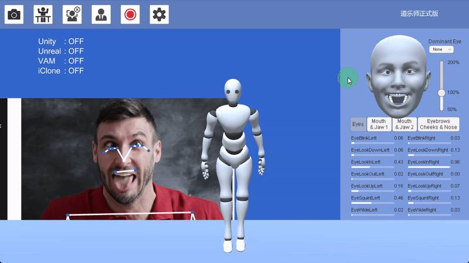

# Facial Capture

Dollars MONO provides ARKit-compatible facial expression capture.

You can turn on or off facial capture using the button in the image.

**Pre-Capture Recommendations:**

- Relax your facial expression.
- Look straight ahead.
- Perform a calibration.

Following these steps will help improve the accuracy of the capture.

## Strength of Facial Expressions

You can control the strength of the facial expressions by using the slider on the right side.

## Dominant Eye
Due to factors like lighting, camera angles, image clarity, or wearing glasses during the capture, there may be instances where the eye gaze of both eyes is misaligned. In such cases, you can ensure synchronized eye gaze by setting a dominant eye.

Please note that setting a dominant eye will prevent you from making crossed-eye expressions.

