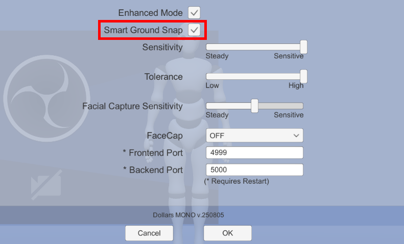
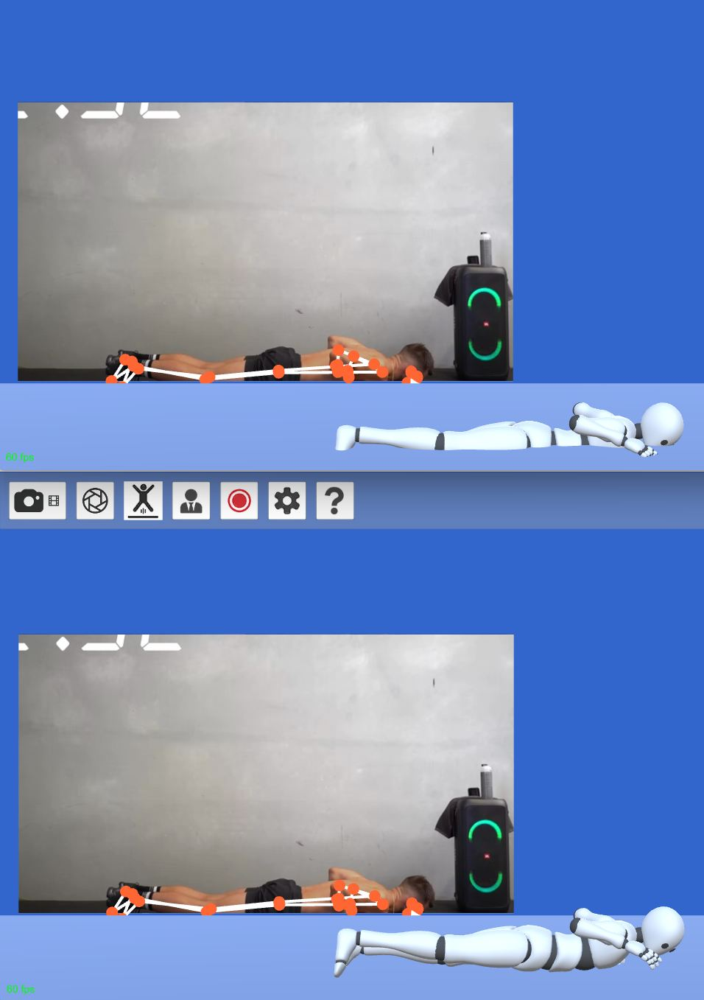

# Smart Ground Snap

The Smart Ground Snap feature can automatically adjust the vertical position of the character when necessary, preventing the character from sinking into the ground.

You can see the difference before and after enabling this feature using the same input in the image below.

:::warning

In some cases, this feature may cause the character's vertical position to become less responsive to changes or result in sudden position jumps.

If you encounter such issues, we recommend disabling the feature to restore normal behavior.

:::
