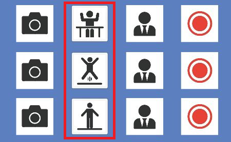

# Motion Capture Mode

Dollars MONO offers three motion capture modes. You can switch between these modes according to your needs by clicking the button.

- Upper Body Mode
- Full Body (Jump) Mode
- Full Body (Ground) Mode

:::warning Note

When Enhanced Mode is activated, Full Body (Jump) and Full Body (Ground) are merged into a single Full Body mode.

At this point, the program provides only two available modes, Upper Body Mode and Full Body Mode.

:::

## Upper Body Mode

In the Upper Body mode, motion capture will only capture your upper body, while the lower body will be locked.

## Full Body (Jump) Mode

In the Jump mode, changes in your waist position will be interpreted as changes in height, allowing for actions such as jumping and crouching.

However, in this mode, you will not be able to move forward or backward.

For example, Jump mode is suitable for the following action,

<iframe width="640" height="360" src="https://www.youtube.com/embed/GW67roizcPk?si=BchmLixZmWUbCIHY" title="YouTube video player" frameborder="0" allow="accelerometer; autoplay; clipboard-write; encrypted-media; gyroscope; picture-in-picture; web-share" allowfullscreen></iframe>

The same video in Ground Mode,

<iframe width="640" height="360" src="https://www.youtube.com/embed/Ss0bqUFUzRM?si=sBoEBp7P58LduU9J" title="YouTube video player" frameborder="0" allow="accelerometer; autoplay; clipboard-write; encrypted-media; gyroscope; picture-in-picture; web-share" allowfullscreen></iframe>

## Full Body (Ground) Mode

In Ground Mode, changes in your waist position are interpreted as movements on the ground, enabling actions such as moving forward or backward. 

However, you won¡¯t be able to capture jumping actions in this mode.

For example, Ground Mode is suitable for capturing actions like walking or running.

<iframe width="640" height="360" src="https://www.youtube.com/embed/71s5SaO9ECs?si=Otp9VUNd_INByWRe" title="YouTube video player" frameborder="0" allow="accelerometer; autoplay; clipboard-write; encrypted-media; gyroscope; picture-in-picture; web-share" allowfullscreen></iframe>

The same video in Jump Mode,

<iframe width="640" height="360" src="https://www.youtube.com/embed/MvghpYhe1Mc?si=7thNBCGeWsNRbcGX" title="YouTube video player" frameborder="0" allow="accelerometer; autoplay; clipboard-write; encrypted-media; gyroscope; picture-in-picture; web-share" allowfullscreen></iframe>

:::info[Notes]

Jump Mode:
Intended for capturing jumping, crouching, and similar actions.

Ground Mode:
Intended for capturing walking, running, and similar actions.

:::

Using the wrong mode will result in less accurate motion capture and may not capture the desired actions. Therefore, it's crucial to understand the differences between the two modes and select the correct one for your intended actions.