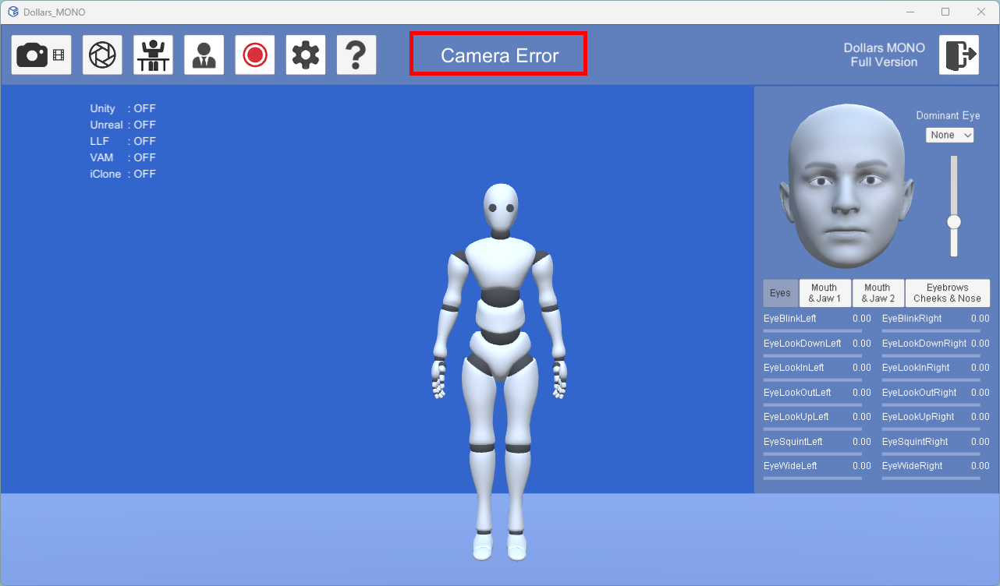

# Error Messages

When MONO encounters an error, an appropriate message will be displayed at the top of the program interface.

Here are some common error messages in MONO and their solutions,

## Camera Error

**Possible Causes:**

- The program doesn't have permission to access the camera.
- There is a hardware issue with the camera.
- The camera is being used by another program.

**Solutions:**

- In Windows settings, ensure that Dollars MONO has permission to access the camera.
- Use the built-in Camera app in Windows to test if the camera is functioning properly.
- Close any other software that may be using the camera and try again.

## Playback Error

**Possible Causes:**

- The video file format is unsupported or the file is corrupted.

**Solutions:**

- Use a compatible video format (MP4 with H.264 encoding is recommended).
- If the file does not play, try re-encoding the video file.

## The Directory Contains Non-English Characters

**Possible Causes:**

The directory or path where the MONO program is located contains non-English characters (such as CJK characters, special symbols, etc.)

**Solutions:**

Ensure that the directory and path where the program is located only contain English characters (including letters, numbers, and common symbols).

For example:

Correct path: `C:\Program Files\Dollars_MONO`

Incorrect path: `C:\程序文件\Dollars_MONO`

## Port already in use

**Possible Causes:**

- Another program is using a port that MONO requires.

**Solutions:**

- Check and close any programs that may be using the port.
- Modify the port number in MONO, as shown in the error message, to avoid conflicts.

## DLL Not Found

**Possible Causes:**

When using the NVIS module, the required library files may not have been installed correctly.

**Solutions:**

Please refer to the instructions [here](/Dollars-MONO/facialcap-module) to download and install the necessary dynamic library files.