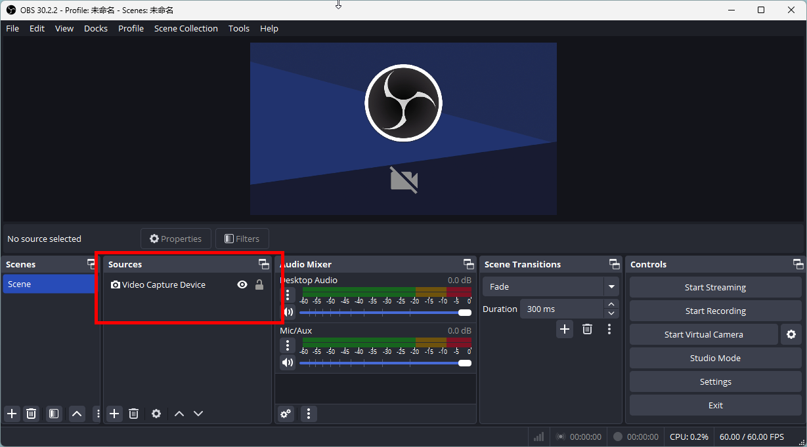
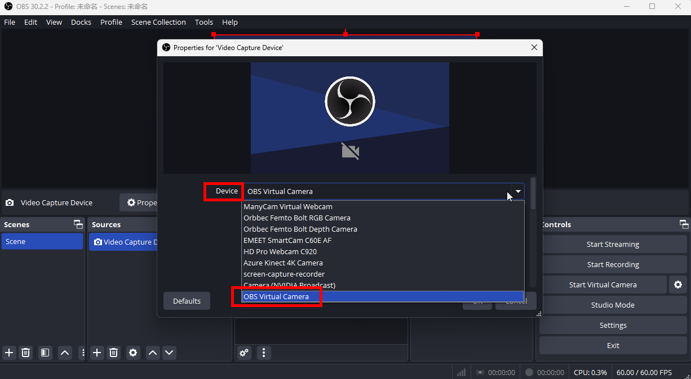
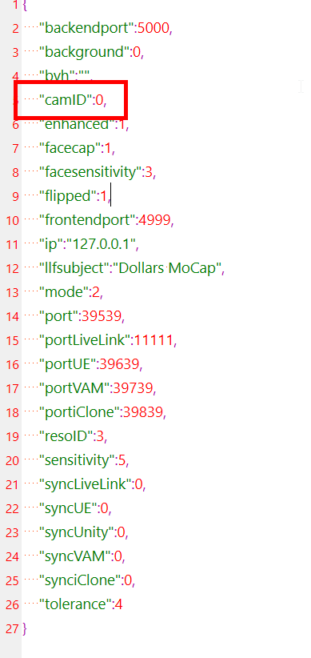

---
sidebar_position: 90
title: FAQ
slug: /mono-faq

---	

# FAQ

import TOCInline from '@theme/TOCInline';

<TOCInline toc={toc} />

## Program Crashes on Startup

**Reason 1: Missing Required Redistributable**

**Solution:**

1. Visit the following page and download the latest Visual C++ redistributable:

[Microsoft Official Download Page](https://learn.microsoft.com/en-us/cpp/windows/latest-supported-vc-redist?view=msvc-170)

Download: [vc_redist.x64.exe](https://aka.ms/vs/17/release/vc_redist.x64.exe)

2. Install the redistributable and restart your computer, then try launching MONO again.

**Reason 2: Camera Initialization Failure**

**Solution:**
1. Download the latest version of OBS from here. https://obsproject.com

2. Open OBS and add a **Video Capture Device**.

3. In the **Device** list, locate **OBS Virtual Camera** and note its position in the list.

4. Open the **settings.json** file located in the MONO directory (if this file does not exist, you can find it at: `C:\Users\{Your Username}\AppData\LocalLow\SunnyView\Dollars_MONO`)

5. In the **settings.json** file, change the value of **camID** to the position of **OBS Virtual Camera** in the list minus 1.

For example, if **OBS Virtual Camera** is in the 3rd position, set **camID** to 2.

6. Launch MONO and check if it starts correctly.

If MONO starts normally after these changes, it suggests that one of the cameras in your list may be causing the crash. You can try each camera one by one and observe which one causes the program to crash.

If you identify a camera causing the issue, please send the list of cameras in MONO to hi@sunnyview.tech, and specify which camera is causing the crash. We will further investigate the issue. Thank you for your cooperation and support!

:::danger Known Issue

The **screen-capture-recorder** camera from ShareX may cause MONO to crash. We recommend avoiding the selection of this camera using the steps outlined above.

:::

## The Camera Cannot Be Turned On

Please check [this](/Dollars-MONO/mono-errors#camera-error) out.

## Characters Are Floating or Stuck in the Grounds

If you're using the camera for real-time capture, performing a [calibration](/Dollars-MONO/calibration) and selecting the appropriate [Motion Capture Mode](/Dollars-MONO/mode) before starting will help prevent characters from floating or sinking into the ground.

If you are experiencing this problem when motion capture is performed via video, you can try to play the video via an external player, capture the playback using OBS, adjust the position appropriately, and then input Dollars MONO via the virtual camera.

For more information on using the OBS virtual camera, refer to the section [Using Virtual Camera as Input](/Dollars-MONO/virtualcam).

## Video Capture Is Stuttering

You can try to lower the video resolution, or video frame rate.

Or you can use an external player to play the video, and then transfer the video into Dollars MONO via OBS's virtual camera. Using an external player can also provide you some playback control, which is easier to use.

You can refer to [Using Virtual Camera as Input](/Dollars-MONO/virtualcam) for more information about how to use the OBS virtual camera.

## Availability of Mac and Mobile Versionss

There are no Mac or cell phone versions of the Dollars MoCap products at this time.

## How to Use Your Cell Phone Camera as Input

To use your cell phone camera, first, find appropriate software to stream the image from your phone to your computer. Then, use the OBS virtual camera to transfer the image into Dollars MONO.

You can refer to [Using Virtual Camera as Input](/Dollars-MONO/virtualcam) for more information about how to use the OBS virtual camera.

## Support for Multiple People or Cameras

Dollars MONO currently supports only a single person and a single camera.

If you want to have multiple characters in the same scene, you can refer to the following tutorials:

[Multi-person motion capture in UE](/ue-multiplayer)

[Multi-person motion capture in Unity](/unity-multiplayer)

Multi-person motion capture in Virt-A-Mate

<iframe width="640" height="360" src="https://www.youtube.com/embed/lbtP2zccvSM?si=otn1dgiLiaNkjKi_&amp;start=265" title="YouTube video player" frameborder="0" allow="accelerometer; autoplay; clipboard-write; encrypted-media; gyroscope; picture-in-picture; web-share" allowfullscreen></iframe>

