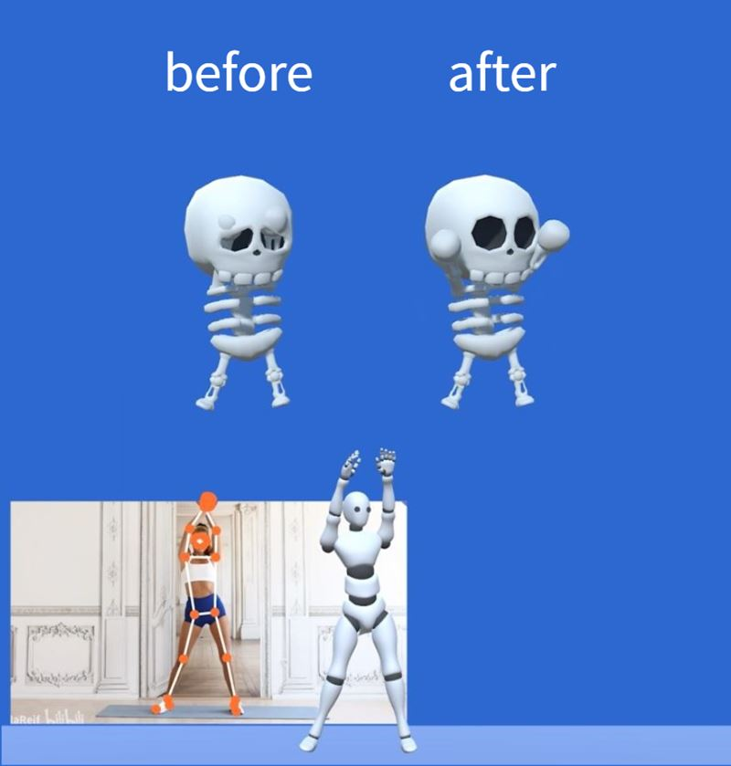
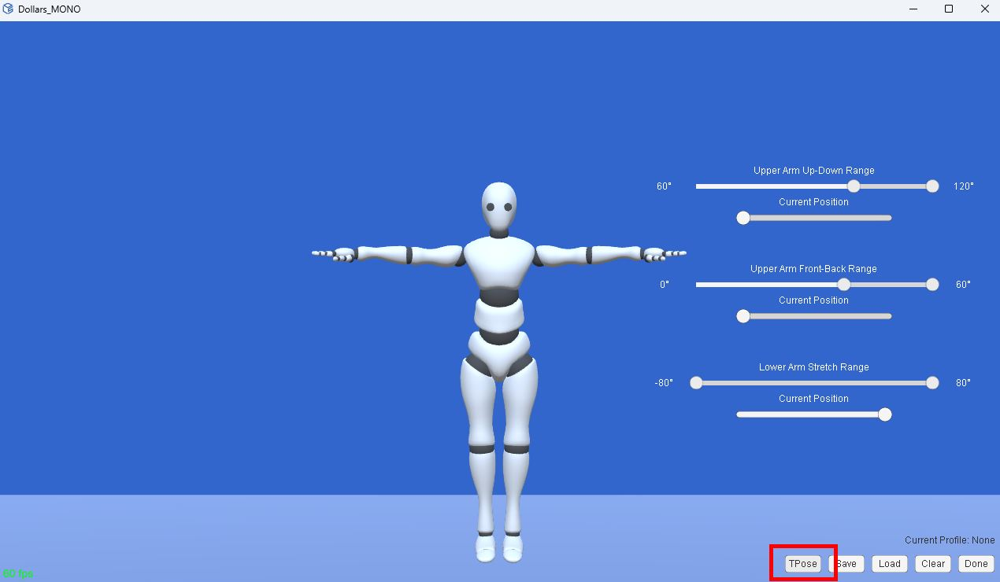

# Setting a Motion Capture Profile

Since version v.250707, MONO supports motion capture Profile configuration.

By setting a Profile, you can limit the range of motion for joints to help reduce clipping issues during capture, as shown on the right side of the image below.

If you are rendering your characters in Unity, you can get a similar result using Unity’s built-in Muscle Settings.

For more information, refer to,

https://github.com/SunnyViewTech/MuscleSettings

:::warning Note

It remains technically challenging to completely eliminate clipping during real-time capture. This feature is designed to provide an effective mitigation approach.

:::

## Setup Steps

### Preparation

1. Make sure your character is properly configured with the Dollars plugin so that motion data can sync correctly.

2. Enable streaming in MONO.

3. Enter the Profile editing mode.

### Set Arm Up-Down Range

When the virtual avatar has a large head or body, the arms placed at the sides may easily intersect with the head or body. You can reduce this issue by limiting the arm’s up and down movement range.

1. Click the TPose button to adjust the avatar to a TPose.

2. Move Current Position all the way to the left and adjust the minimum value of Upper Arm Up-Down Range.

3. Move Current Position all the way to the right and adjust the maximum value of Upper Arm Up-Down Range.

4. Adjust Current Position back and forth, observe the avatar’s movement, and confirm whether the effect meets expectations.

<video controls width="50%">
  <source src="/2025-09-23 19-37-54-638_1.mp4"/>
</video>

5. Click **Save** to complete the setup.

### Set Arm Front-Back Range

When the avatar’s arms are too long, they may cross in front of the body. You can reduce this issue by limiting the arm’s front and back movement range.

1. Click the TPose button to adjust the avatar to a TPose.

2. Adjust the upper and lower limits of Upper Arm Front-Back Range.

<video controls width="50%">
  <source src="/2025-09-23 19-58-49-339_1.mp4"/>
</video>

3. If necessary, adjust the upper and lower limits of Upper Arm Up-Down Range.

<video controls width="50%">
  <source src="/2025-09-23 19-58-49-339_2.mp4"/>
</video>

4. Adjust the upper and lower limits of Lower Arm Stretch Range.

<video controls width="50%">
  <source src="/2025-09-23 19-58-49-339_3.mp4"/>
</video>

5. Adjust both Upper Arm Up-Down Range and Lower Arm Stretch Range so that the size of their ranges is similar.

<video controls width="50%">
  <source src="/2025-09-23 19-58-49-339_4.mp4"/>
</video>

6. Adjust each Current Position, and check the result.

<video controls width="50%">
  <source src="/2025-09-23 19-58-49-339_5.mp4"/>
</video>

7. Click **Save** to complete the setup.

## Multiple Profiles

The saved Profile will be automatically loaded each time the program starts.

You can also set up separate Profiles for different characters and load them as needed.