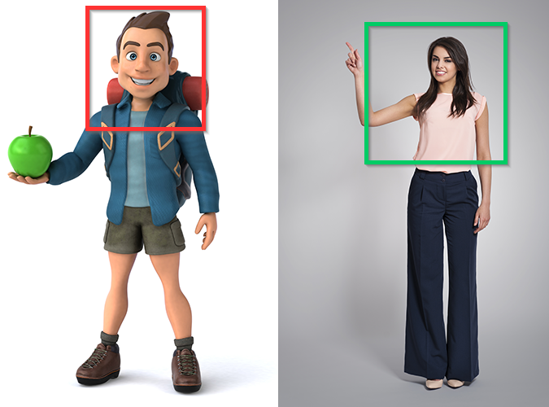
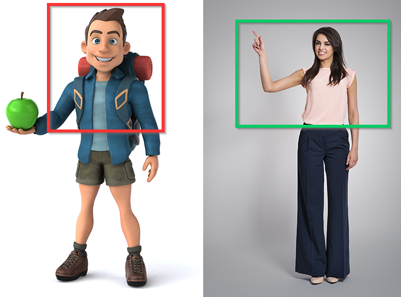
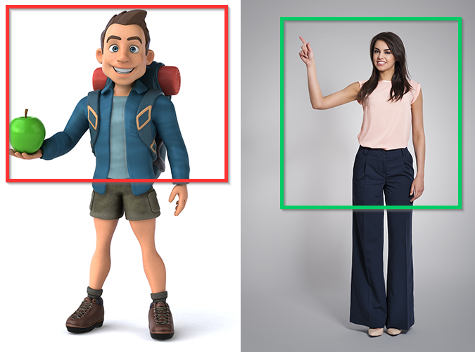
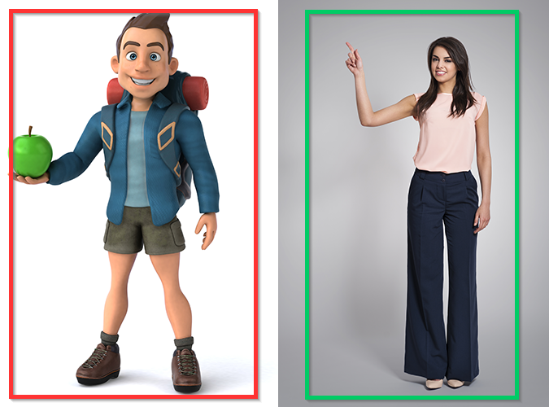
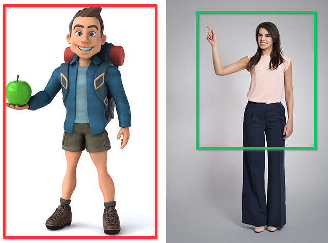

# Read Me First

Please ensure you have thoroughly read the content of this page before diving deeply into Dollars MONO.

## Frame Coverage Recommendations

Whether your input source is a camera or a video, **always ensure that the actor's frame coverage is larger than that of the virtual character**.

### Shoulder-Up View

If you want the virtual character to appear from the shoulders up, it's best to film the actor down to the elbows.

### Elbow-Up View

If you want the virtual character to appear from the elbows up, it's best to film the actor down to the hands.

### Full Hand Visibility

If you wish for the virtual character's hands to be fully visible, film the actor down to below the waist, ensuring that when the hands hang down, they remain within the camera's frame.

### Full-Body View

If you want the virtual character to be fully visible, the actor also needs to be fully within the frame.

:::info[Exception]

If you're using the upper-body mode and want the virtual character fully visible, the actor can be filmed down to below the waist without needing to be entirely within the frame.

:::

## Calibration before motion capture

Proper calibration before motion capture ensures better accuracy in capturing movements and expressions.

:::info

During calibration, please relax your body and facial expressions, let your hands hang naturally by your sides, and look straight ahead.

:::

Image courtesy of Freepik:

[Image by gpointstudio](https://www.freepik.com/free-photo/fashionable-smiling-woman-showing-empty-copy-space_11342232.htm#page=3&query=short%20tall&position=38&from_view=search&track=ais) 

[Image by julos](https://www.freepik.com/free-photo/fun-illustration-3d-cartoon-backpacker_13789537.htm#page=3&query=character%20full%20body&position=10&from_view=search&track=ais)
