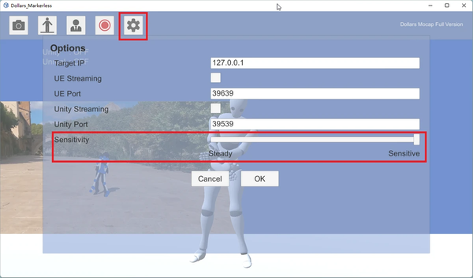

# Motion Capture Sensitivity

You can adjust the motion capture sensitivity settings to achieve different results based on your needs.

The video below demonstrates the impact of varying sensitivity levels on the motion capture outcomes.

<iframe width="640" height="360" src="https://www.youtube.com/embed/QUW-s6oyzuQ?si=fP2bZiz83OFg4IsC" title="YouTube video player" frameborder="0" allow="accelerometer; autoplay; clipboard-write; encrypted-media; gyroscope; picture-in-picture; web-share" allowfullscreen></iframe>