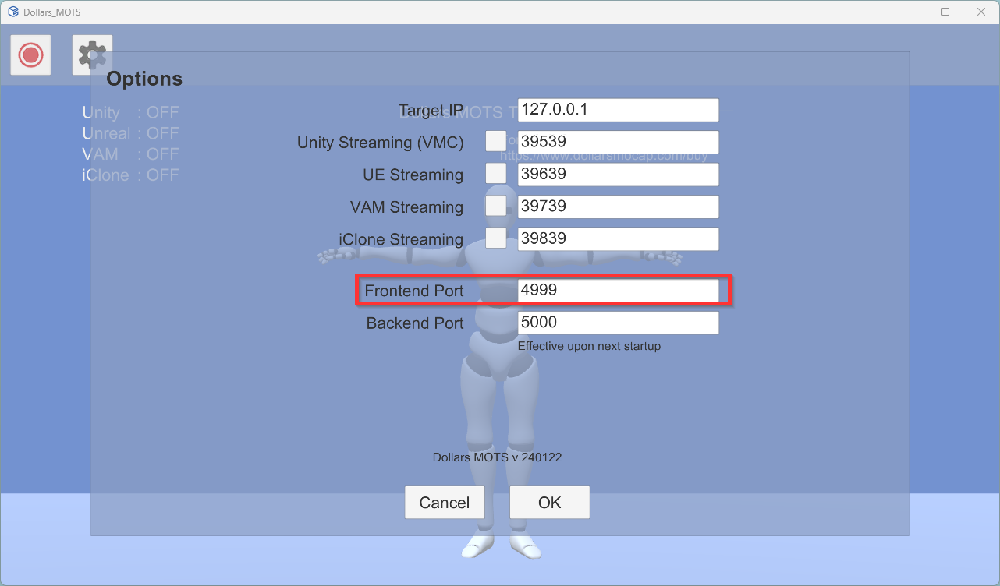

# Using the API

You can use the OSC protocol to communicate with the MOTS frontend to control the character's movements.

## OSC Command

|address|parameter|description|
|:---:|:---:|:---:|
|/dollars/generate|string| string is the description of the action, in English.|

## Port

The MOTS frontend listens to port 4999 by default.

You can change it in the Settings window. After that you need to restart MOTS front end to make the change effective.

## Sample Projects

### OSC sample

https://github.com/SunnyViewTech/MOTS-OSCSample

This project includes Python, Unreal Engine, and Unity implementations.

### Using voice to control actions

https://github.com/SunnyViewTech/MOTS-VoiceCmdSample

This project contains examples of using English speech via the Microsoft Azure API and OSC protocol to control the MOTS frontend. It also includes examples of using Chinese speech with Baidu for speech recognition and Chinese-to-English translation.