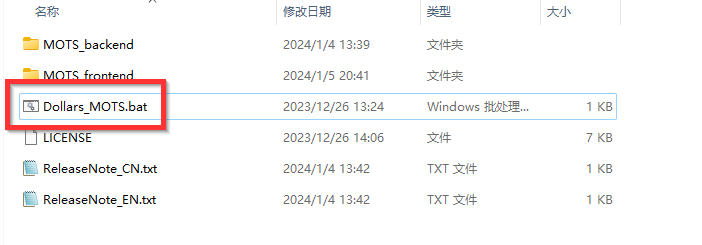
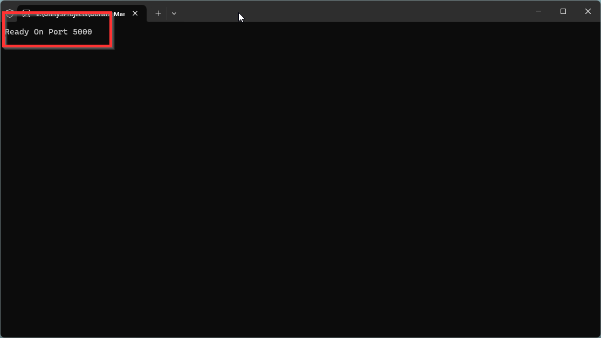
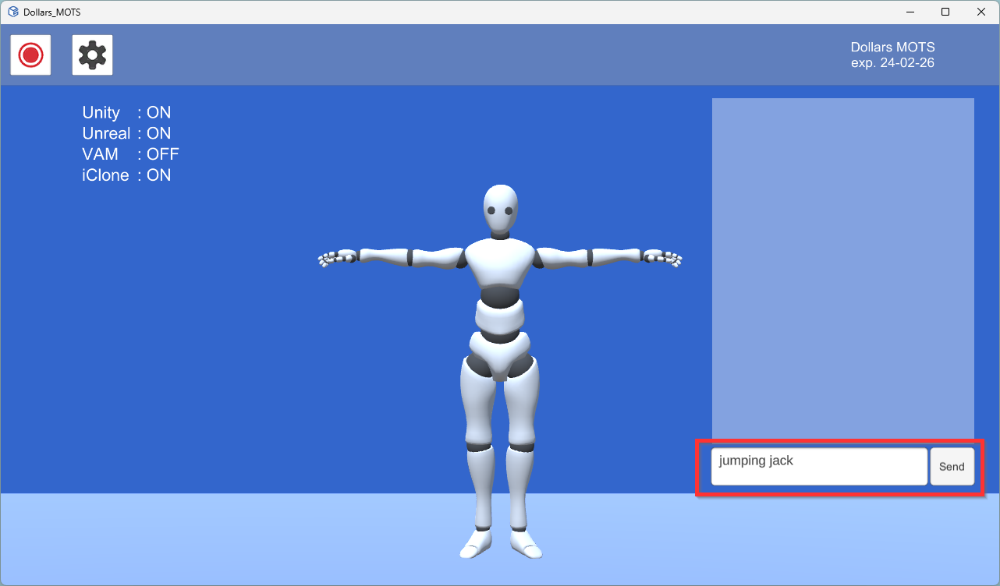
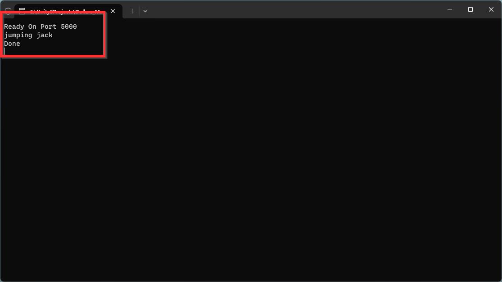
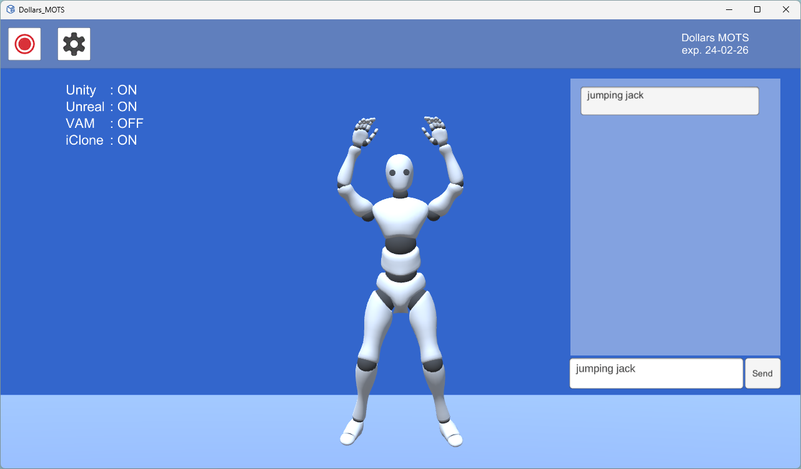
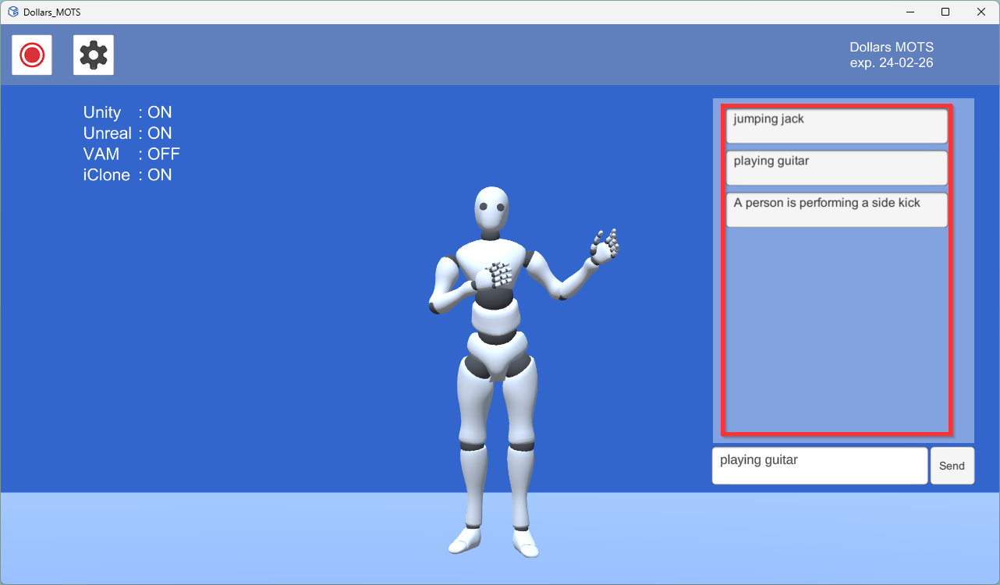

# Get Started

Dollars MOTS consists of both frontend and backend components. You can start both simultaneously by clicking on the `Dollars_MOTS.bat` in the Dollars MOTS directory.

The backend may take some time to start. When "Ready On 5000" appears in the program, it indicates that the backend has successfully started.

At this point, you can enter your text in the frontend program and click the Send button.

The backend program will display the received text command and show "Done" after generating the motion.

The frontend program will then display the generated motion.

Generated motions will appear in the list on the right side of the frontend program. Clicking on an item in this list will replay the corresponding motion.s

