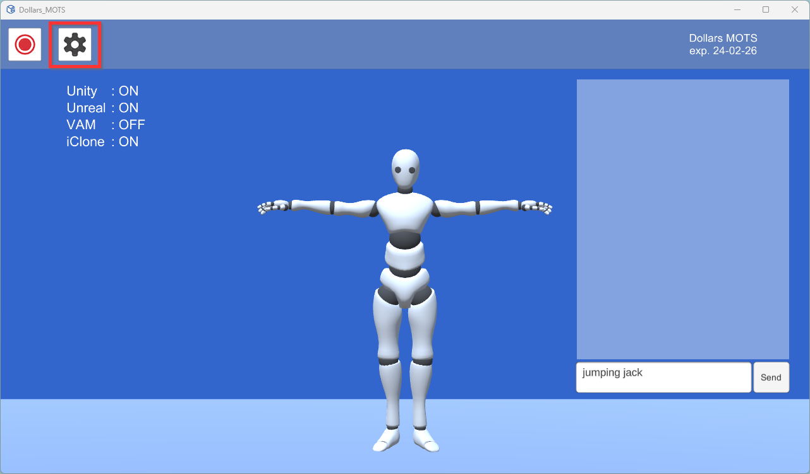
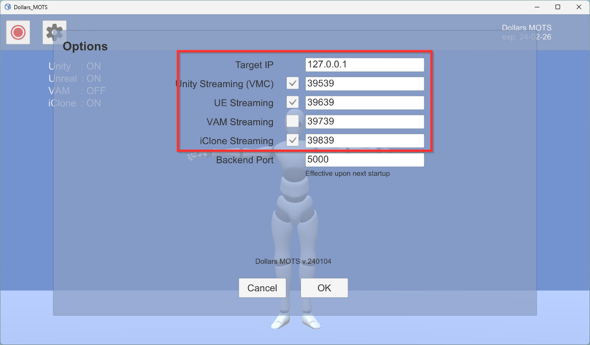
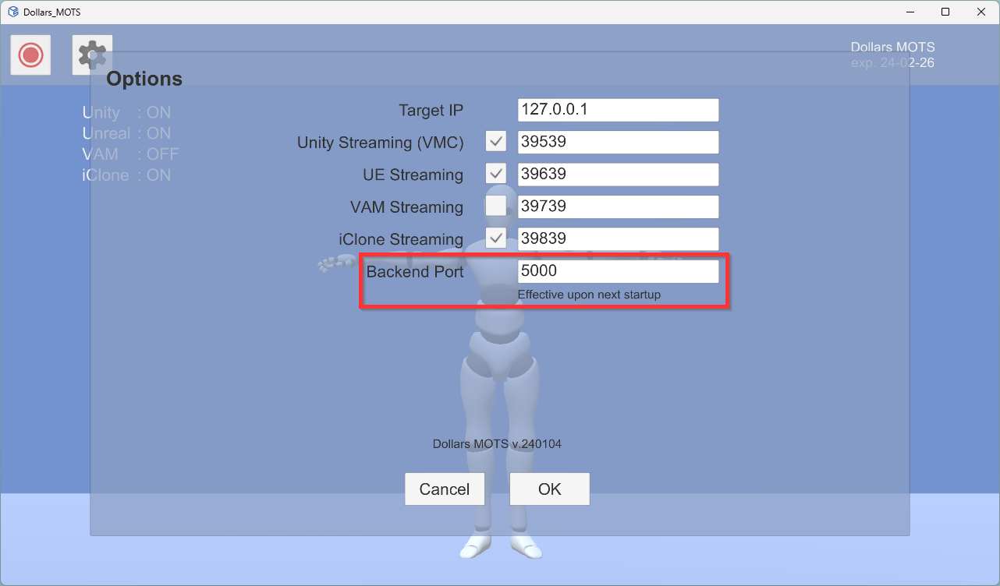

# Settings

You can open the program settings by clicking the gear icon.

Through these options, you can modify the target IP and streaming port, and turn streaming on or off.

The Dollars MOTS frontend and backend programs communicate via port 5000.

If another program on your computer is already using this port, you can resolve the conflict by changing the port.

:::info

After changing the port, you need to restart the programs to apply the changes.

:::
