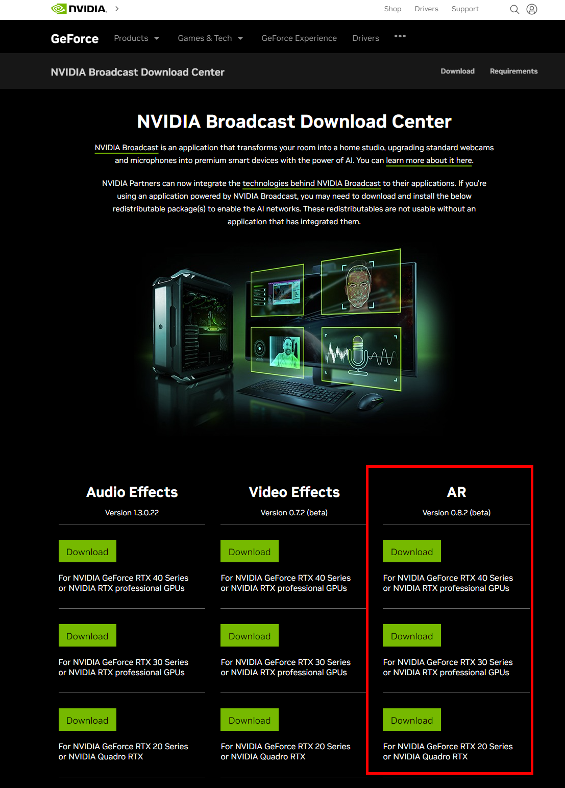
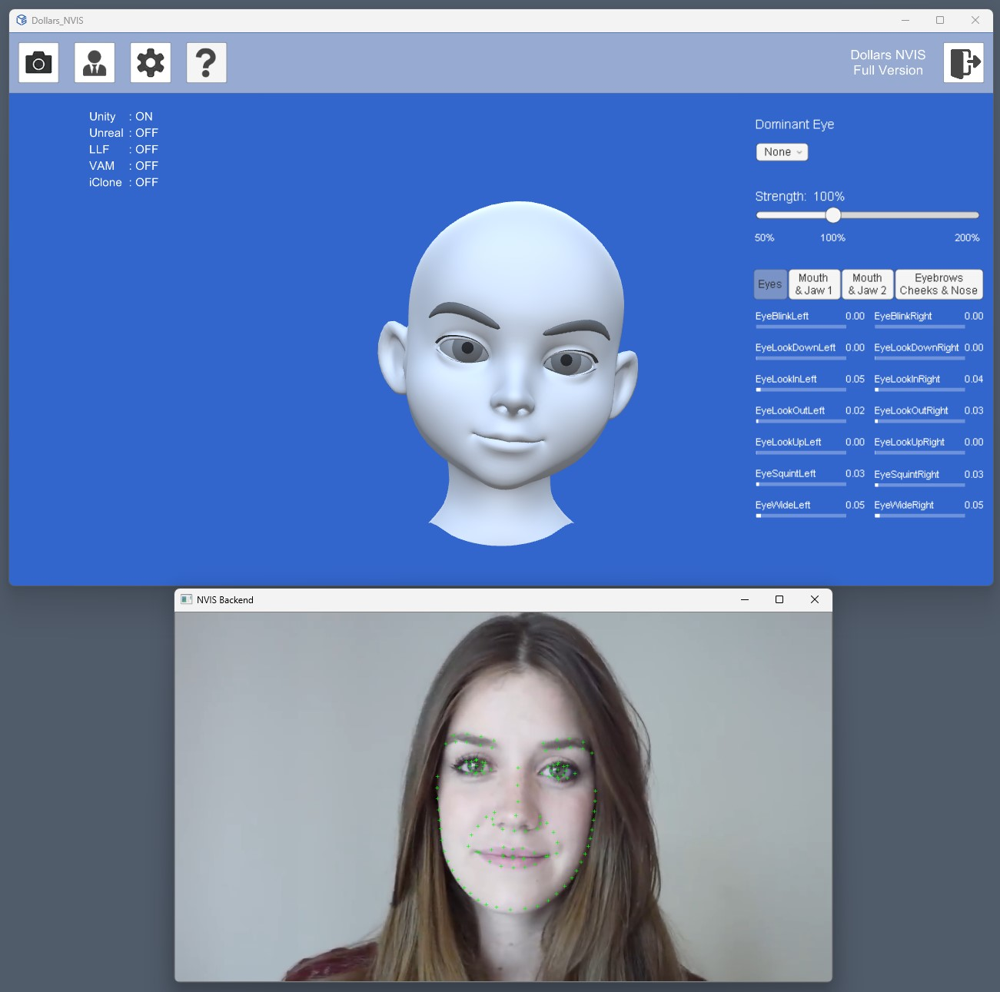

# Get Started

Before using Dollars NVIS, you need to download the corresponding package for your graphics card from the NVIDIA Broadcast Download Center and install it. Reboot is recommended after installation.

https://www.nvidia.com/en-us/geforce/broadcasting/broadcast-sdk/resources/

Once properly installed, run NVIS and you will see two windows for the NVIS front end (top half of the image below) as well as the back end (bottom half of the image below).

