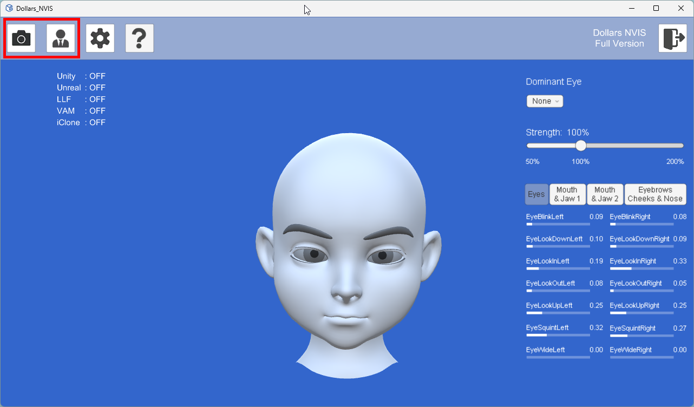
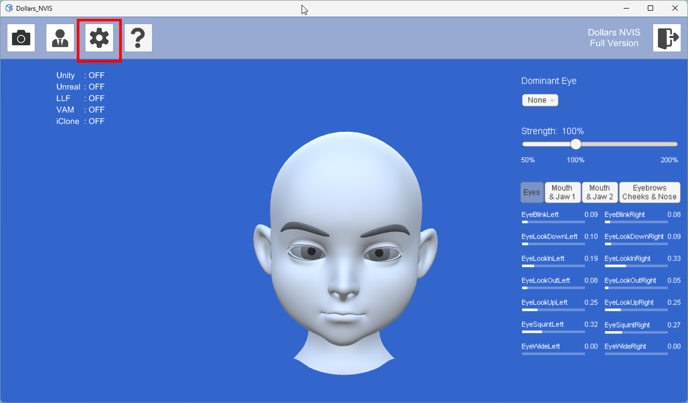
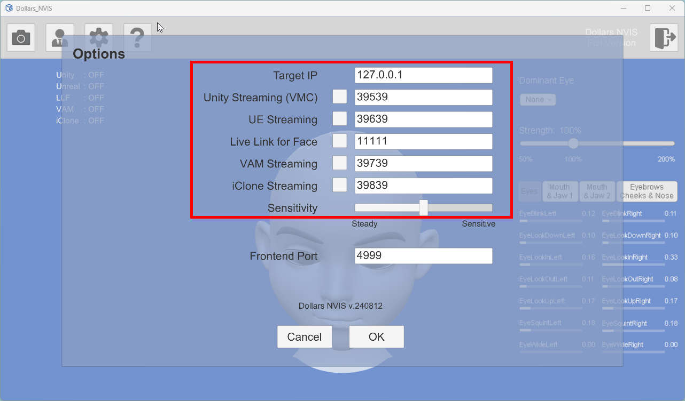
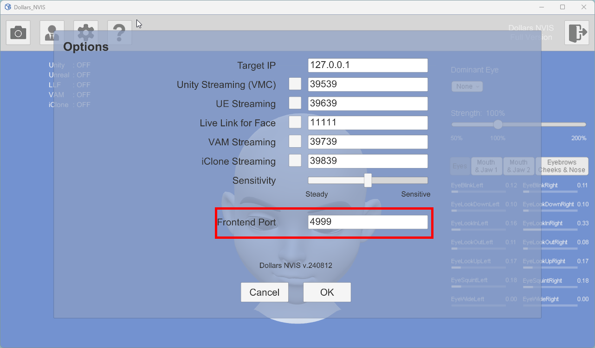

# Settings

Similar to other Dollars MoCap products, you can select your camera and calibrate using the button in the upper left corner. 

By clicking the gear icon, you can access more options. 

These options allow you to modify the target IP, port, and enable or disable various streaming features.

Dollars NVIS frontend will use port 4999 for communication with the backend. If another program on your computer is already using this port, you can resolve the conflict by changing the port value.

