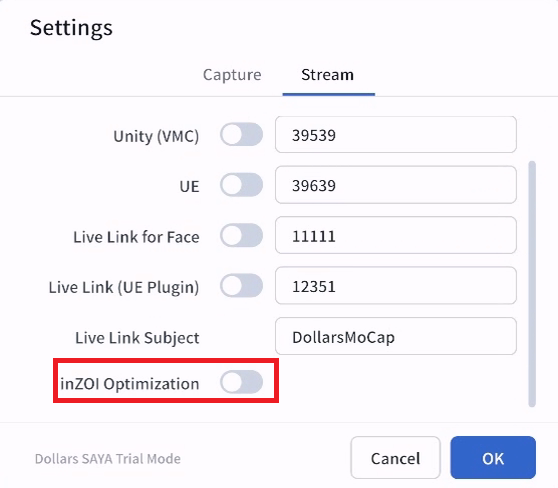

---
sidebar_position: 70
title: inZOI Optimization
---	

# inZOI Optimization

When sending motion data to inZOI, we recommend completing the following two settings in order.

## Load the inZOI VRM

First, use [Load VRM](./loadvrm.md) to load the VRM file that comes with inZOI. Motion will then be solved based on the inZOI character's proportions and fit the character better.

## Enable inZOI Optimization

Then, enable the inZOI Optimization option in the SAYA settings.

## What It Improves

With both settings in place, capture results improve in the following ways,

- A more natural standing posture, with less foot penetration into the ground.

- Less finger distortion when the hands are clenched into fists.

