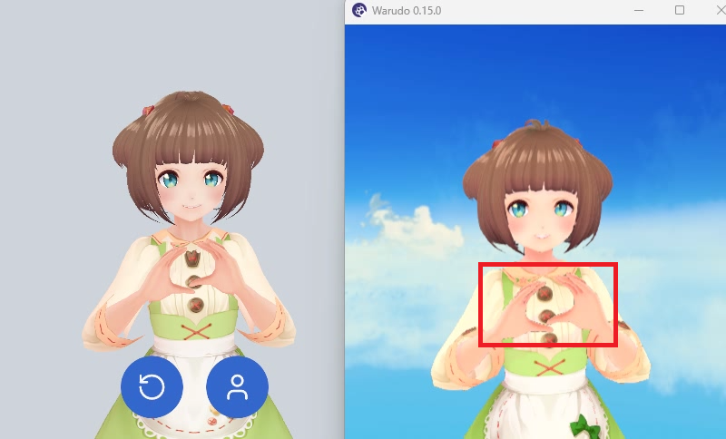

# Load VRM

## Why Load a VRM

By default, SAYA solves motion based on the body proportions of the built-in Dollars MoCap model. When your character differs noticeably from the built-in model in proportions such as shoulder width and arm length, poses that require precise alignment, like pressing both hands together, can end up off, with the hands apart or clipping into each other.

After you load your VRM, SAYA solves and outputs motion directly based on that model's bone proportions. Characters of different body types fit your motion naturally, with no need to manually enter parameters such as the upper arm span.

## Steps

1. Transfer your character's VRM file to your iOS device, for example via AirDrop, iCloud Drive, or a USB cable.
2. In SAYA, tap the button below and choose your VRM in the dialog.

Once loaded, the VRM will load automatically every time SAYA starts.

:::info

Loading a VRM only affects the output of the Unity (VMC) protocol. Other protocols are not affected.

:::
