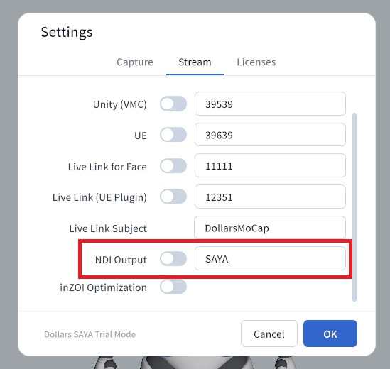
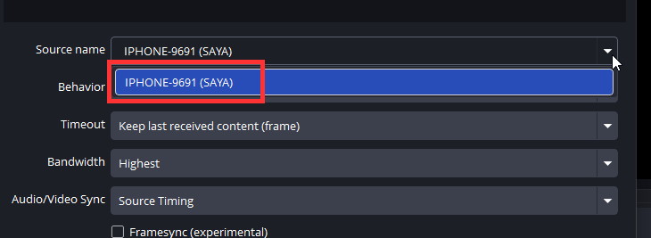

# NDI Output

SAYA can stream the rendered avatar image over NDI to a computer on the same local network, where it can be used directly as a source in OBS. Rendering happens on the device, so no avatar software needs to run on the computer, freeing up more resources for streaming, recording, and other tasks.

## Before You Start

First load your avatar with [Load VRM](./loadvrm.md), and make sure the device and the computer are on the same local network.

## Enable NDI Output

In the SAYA settings, turn on the NDI Output switch. The field next to the switch sets the name of the NDI source. It defaults to SAYA and can be changed as needed.

## Receiving in OBS

Before first use, install the OBS NDI plugin DistroAV (formerly obs-ndi) and the NDI runtime it depends on, then restart OBS.

In OBS, add a source and choose NDI Source,

then select your device from the source list. The name is usually the device model plus four random letters, with the NDI name from the settings in parentheses. Once selected, you will see the avatar rendered in real time.

:::info

After enabling NDI output, it may take 30 seconds to a minute for the source to appear in OBS.

If it still does not appear after waiting, make sure the device and the computer are on the same local network, and check whether the computer's firewall is blocking NDI.

:::
