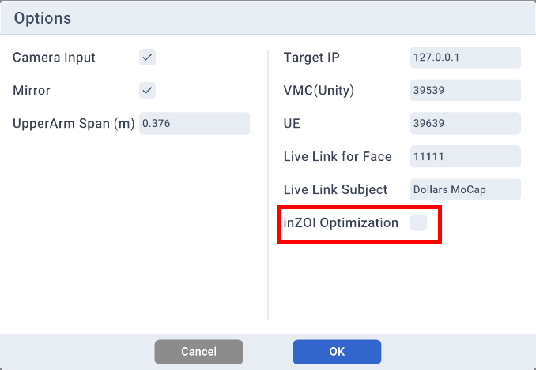
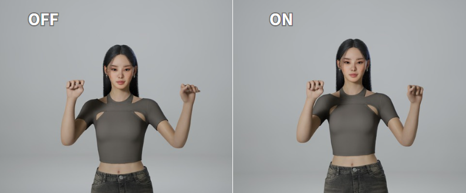
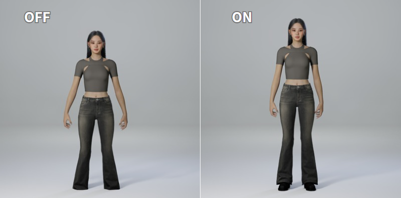

---
sidebar_position: 50
title: Program Options
className: translation-complete
---	

# Program Options

Most of the options in the program are self-explanatory. The following are some that require additional clarification.

## Upper Arm Span

Please enter the horizontal distance between the left and right UpperArm bones (not the shoulders) of the model you plan to use for final display.

Due to potential tracking inaccuracies, it is recommended to slightly increase this value for better results.

The default value is 0.376, which corresponds to the UpperArm distance of the Dollars MoCap avatar.

## inZOI Optimization

It is recommended to enable this option when sending data to inZOI.

This option provides the following improvements.

- Reduces finger distortion when hands are clenched into fists.

- Produces a more natural standing posture while minimizing foot penetration into the ground.

