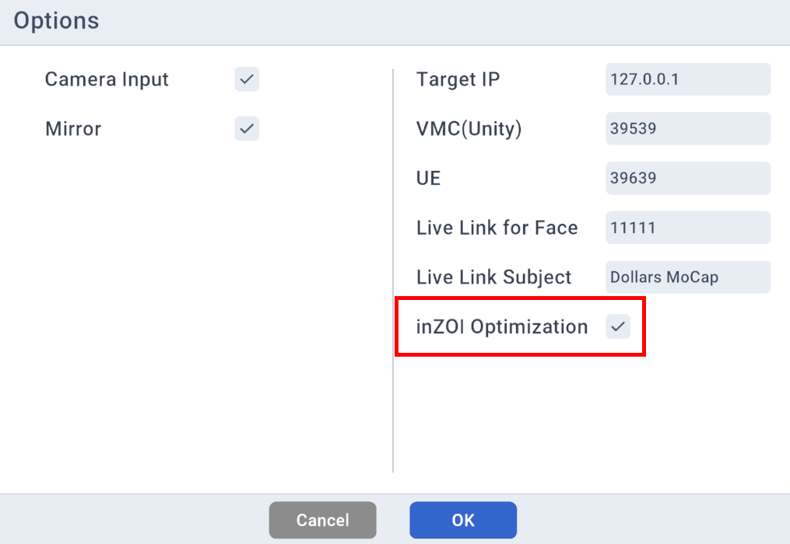

---
sidebar_position: 20
title: Program Options
---	

# Program Options

Most of the options in the program are self-explanatory. The following are some that require additional clarification.

## inZOI Optimization

It is recommended to enable this option when sending data to inZOI.

This option provides the following improvements.

- Reduces finger distortion when hands are clenched into fists.

- Produces a more natural standing posture while minimizing foot penetration into the ground.

