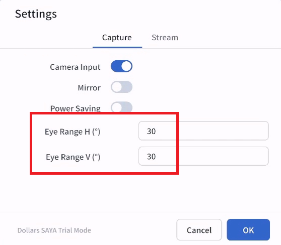
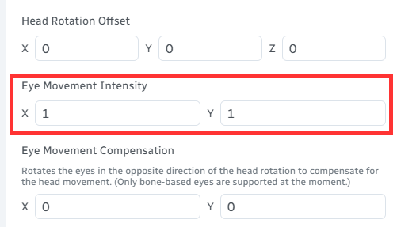

---
sidebar_position: 50
title: Program Settings
className: translation-complete
---	

# Program Settings

Most of the settings in the program are self-explanatory. The following are some that require additional clarification.

## Eye Rotation Range

Some models' eyes cannot be driven by ARKit's eye BlendShapes. For these models, you can use the VMC data of the eye bones to control eye rotation instead, and set the horizontal and vertical ranges for each model.

To find the range values, rotate the model's eye bones to the limit position on one side and use the angle at that point.

For example, the horizontal range of the following model can be set to 12 degrees.

The vertical range can also be set to 12 degrees.

For the following model, the horizontal range can be set to 30 degrees.

And the vertical range can be set to 20 degrees.

Note that the orientation of the eye bones follows the VRM standard.

You can usually also adjust the range on the receiving side. The following uses Warudo as an example.

