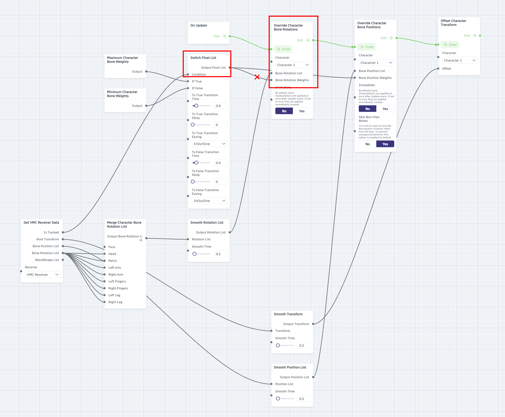

# Warudo Hand Animation Blending

Dollars SAYA can automatically switch between motion capture and preset animations in Warudo based on hand visibility.

:::info Note
This is one possible implementation. If you have a better approach, we'd love to hear from you. Please feel free to [reach out to us](https://www.dollarsmocap.com/contact).
:::

## Prerequisites

- Dollars SAYA is connected to Warudo via VMC protocol.

## 1. Download the Custom Node Script

Download **DollarsMoCapHandFallbackNode.cs** from the [Dollars MoCap website](https://www.dollarsmocap.com/download#misc) and place it in Warudo's Playground folder:

```
<Warudo Install Directory>/Warudo_Data/StreamingAssets/Playground/DollarsMoCapHandFallbackNode.cs
```

:::tip How to find the Playground folder
In Warudo, click **Menu → Open Data Folder**. The `Playground` folder is inside the opened directory.
:::

Warudo will automatically compile and load the script. Once compiled, the **DollarsMoCap Hand Fallback** node will appear in the blueprint node list.


## 2. Modify the VMC Tracking Blueprint

Open the VMC **Pose Tracking** blueprint in Warudo and locate the **Switch Float List** and **Override Character Bone Rotations** nodes.

First, disconnect the wire between **Output Float List** and **Bone Rotation Weights**.



Then insert the **DollarsMoCap Hand Fallback** node between them and connect as shown below.


The completed data flow:

| Port | Connected From |
|---|---|
| DollarsMoCap Hand Fallback → **Input List** | Switch Float List → Output Float List |
| DollarsMoCap Hand Fallback → **Blend Shape List** | Get VMC Receiver Data → BlendShape List |
| Override Character Bone Rotations → **Bone Rotation Weights** | DollarsMoCap Hand Fallback → Output List |

## Adjust Smoothing

The DollarsMoCap Hand Fallback node has a **Smooth Time** slider (default 0.2) that controls how smoothly the transition occurs between motion capture and preset animations.
