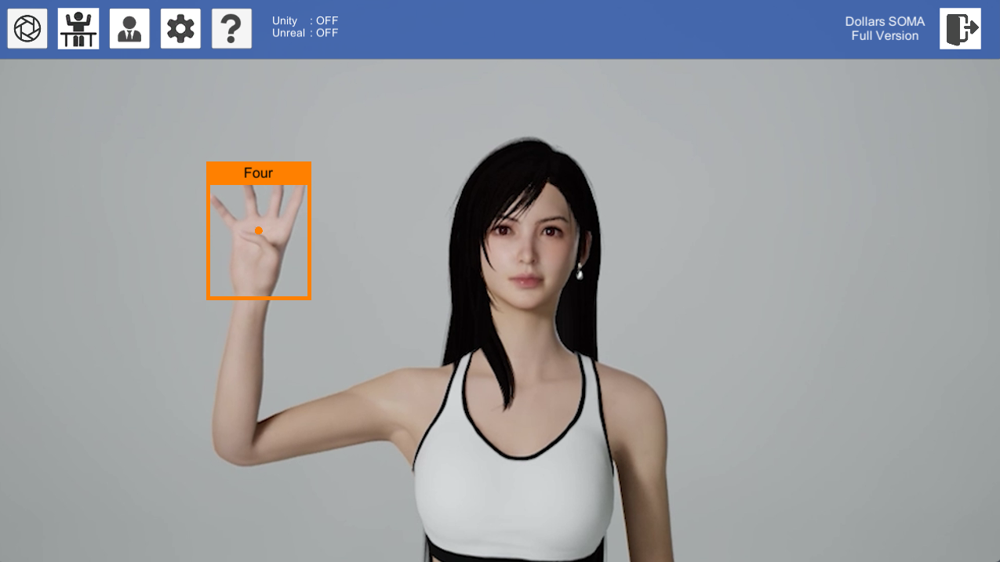
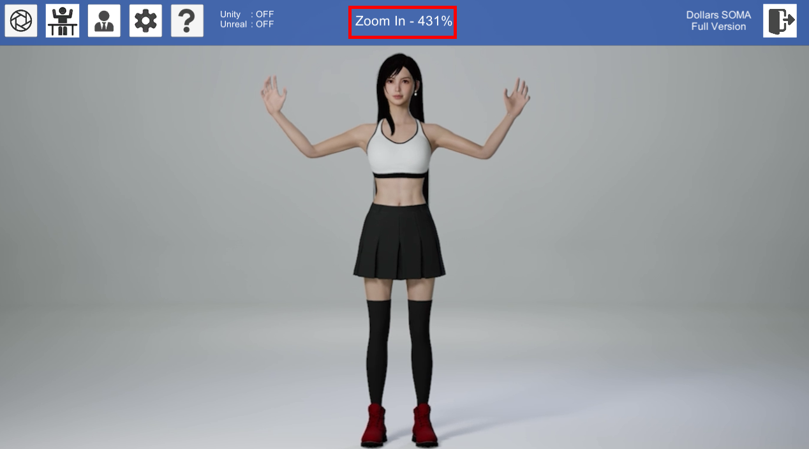
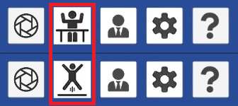
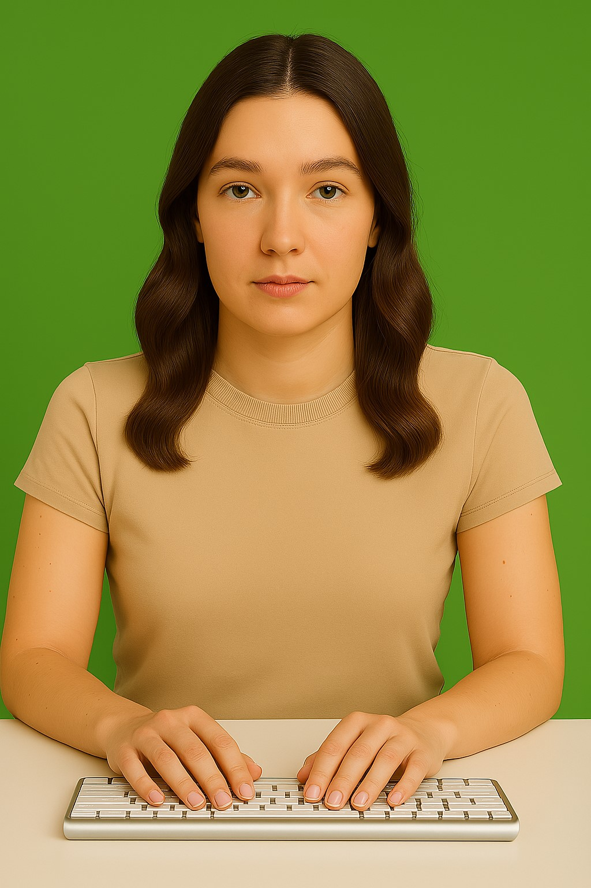
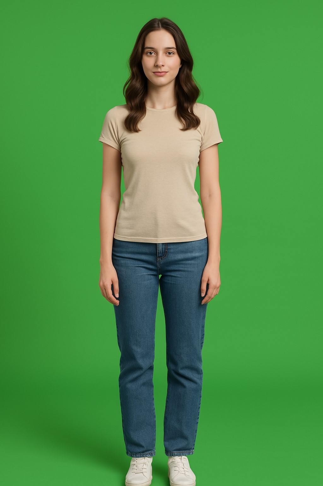

# Get Started

When first launched, the application will activate your device's primary camera. You'll be able to see recognized hand gestures displayed intuitively on screen, while detected body postures will be visualized in the upper portion of the display.

## Camera Options

You can click the Camera Options button to access a dialog box where you can select different cameras and modify resolution settings.

## Mode

By clicking the Mode button, you can switch between upper body and full body modes.

In upper body mode, the skeletal structure below the waist of the white avatar will be fixed. This is suitable for situations where the camera cannot capture the performer's full body.

:::warning

Jump actions will only be recognized in full body mode.

:::

## Calibration

We recommend performing a calibration before recognizing body postures, as this will significantly improve recognition accuracy.

In upper body mode, please keep your arms naturally hanging down or resting flat on the desktop while facing forward.

In full body mode, simply keep your entire body relaxed with legs naturally together.

