# Hand Gestures

SOMA currently supports recognition of the following gestures.

## Gesture Events

Gesture events are sent once when the corresponding gesture is recognized. Maintaining the same gesture will not cause events to be repeated. New events are only triggered after the gesture changes.

## Gesture Overview

The **Gesture Name** is the gesture string that can be received in Unreal Engine and Unity.

|Gesture Name|Display Name|Triggering Gestures|
|---|---|---|
|Call|Call|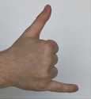 
|Dislike|Dislike|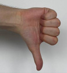 
|Fist|Fist|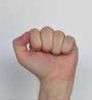 
|Four|Four|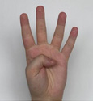 
|Like|Like|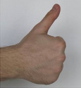 
|Mute|Mute|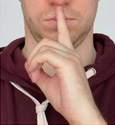 
|Ok|OK|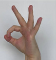 
|One|One|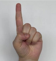 
|Palm|Palm|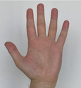 
|Peace|Peace|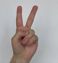 
|PeaceInverted|Peace Inv.|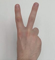 
|Rock|Rock|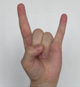 
|Stop|Stop|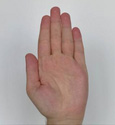 
|StopInverted|Stop Inv.|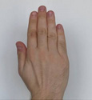 
|Three|Three|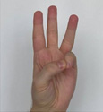 
|TwoUp|Two Up|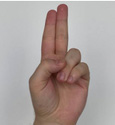 
|TwoUpInverted|Two Up Inv.|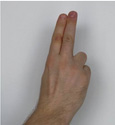

Image Credits:

https://github.com/hukenovs/hagrid
