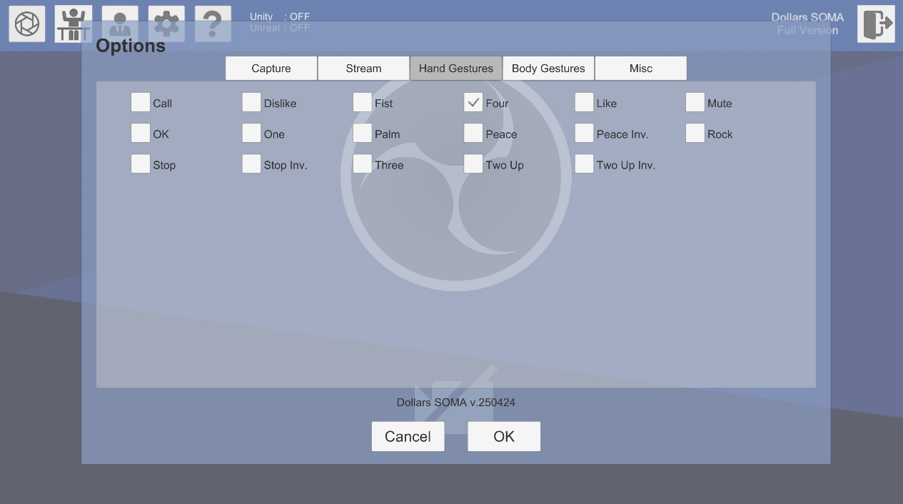
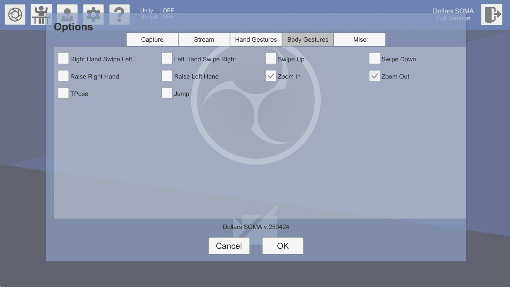

# Settings

You can click the gear button to open program settings.

## Capture

### Sensitivity

Please refer to the [relevant page in MONO](/Dollars-MONO/sensitivity).

### Tolerance

Please refer to the [relevant page in MONO](/Dollars-MONO/tolerance).

### Hand Gesture Tolerance

Higher settings make gesture recognition easier to trigger but may increase the rate of false recognitions.

### Hand Gesture Frequency

The frequency at which hand gesture recognition is performed.

:::warning

Since hand gesture recognition consumes significant system resources, we recommend selecting an appropriate frequency for your usage scenario.
:::

## Stream

Please refer to the [relevant page in MONO](/Dollars-MONO/engines).

## Hand Gestures

You can check the hand gestures you want to recognize here.

## Body Gestures

You can check the body gestures you want to recognize here.

:::warning

We recommend only checking necessary gestures to avoid misidentification between gestures (such as confusion between SwipeUp and RaiseRightHand).

:::

