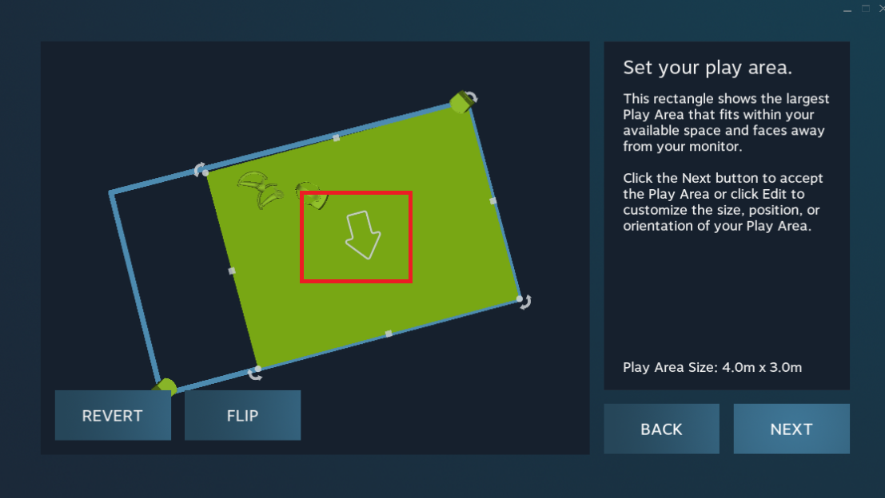

# Before Started

During the room setup stage in SteamVR, please make sure that the forward direction of SteamVR (the direction the arrow points to in the following image) aligns with the direction the motion capture actor is facing.

