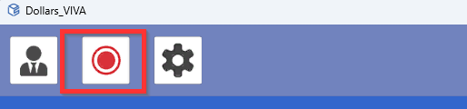
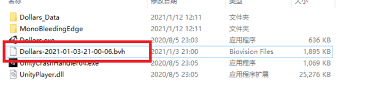

# Record BVH Files

You can record BVH files by pressing the button in the top left corner.

Press the button again to end the recording.

The BVH file will be saved in the Dollars VIVA's root directory with the current timestamp as the filename.

:::info

Recording frequency: 60FPS
 
Estimated size: 10M per minute

:::
