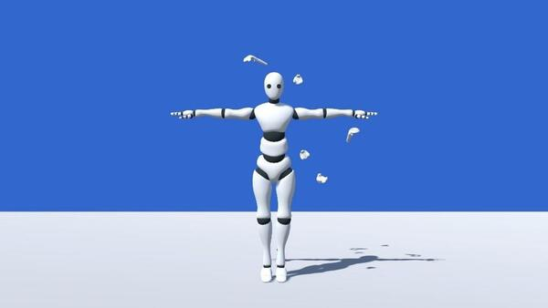
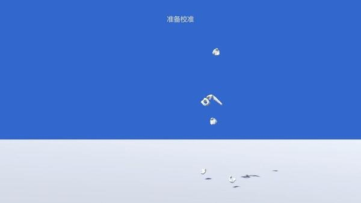
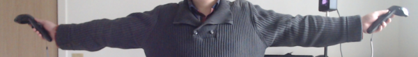
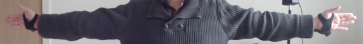
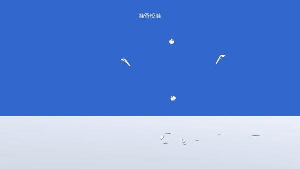
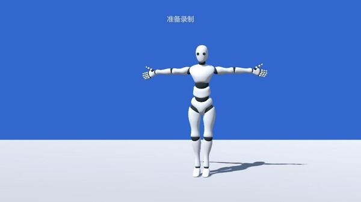

# Get Started

Before starting motion capture, it is necessary to perform a calibration.

Once you have put on the trackers and launched Dollars VIVA, you should see an interface similar to the image below, which displays a mannequin used for motion capture and the positions of the various trackers.

## Pre-Calibration

Press the **C** key or click the calibration button in the top left corner to enter the pre-calibration state.

At this point, please confirm that the VIVE controllers or trackers are being tracked correctly.

After confirming that each tracker is correctly tracking, you can assume the calibration pose and prepare for calibration.

:::info

The calibration pose for Dollars VIVA is as follows:

- **Standing Position:** Stand up straight with your feet together and toes pointing forward.
- **Arm Position:** Stretch your arms straight out to the sides, relax your wrists, and ensure your palms are facing forward.
- **Head Position:** Look straight ahead with your eyes level.

:::

This is the case when you are holding the HTC VIVE controllers.

This is the case when you are using the HTC VIVE Trackers.

Regardless of whether you are using the controllers or trackers, your palms should always be facing forward.

At this stage, the controllers and trackers should appear on the Dollars VIVA screen similar to the following,

## Calibration

Press the **C** key, or click the calibration button in the upper left corner, or pull the trigger on the controller to enter the calibration countdown.

Maintain the calibration posture throughout the countdown. Once the countdown is over, the calibration will finish, and the mannequin will appear again.

If your calibration posture is not accurate, it will affect the motion capture results. You can press the **C** key, or click the calibration button, to recalibrate.

:::info  Summary

To enter pre-calibration stage，

- Press the C key
- Click the calibration button on the top left corner

To trigger the calibration countdown,

- Press the C key
- Click the calibration button on the top left corner
- Pull the trigger on the controller

The purpose of this design is to prevent accidental triggering of the controller's trigger during motion capture.

:::