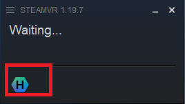
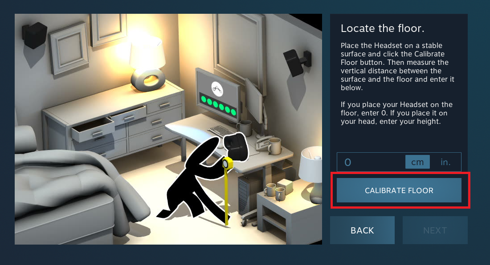
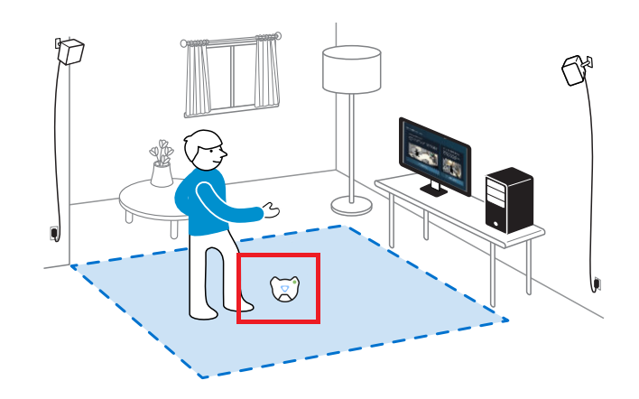
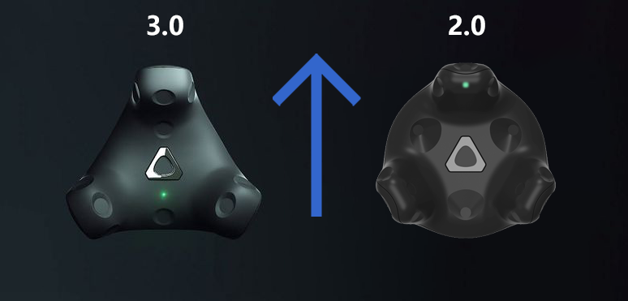
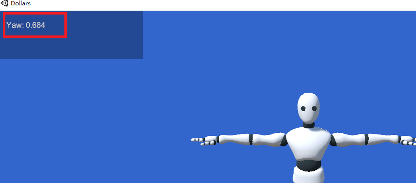
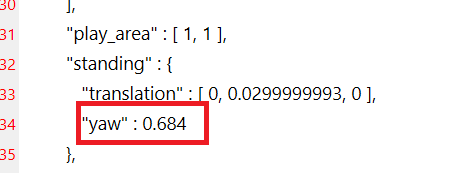
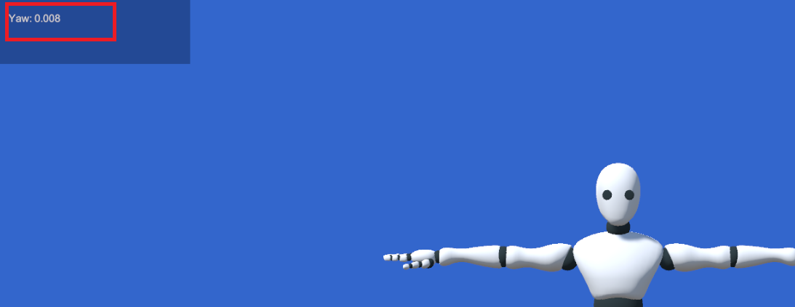
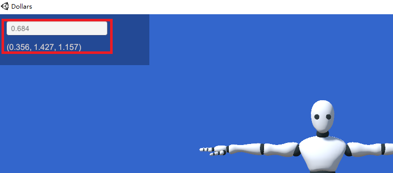
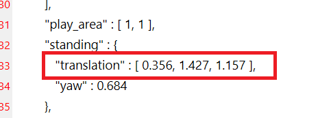
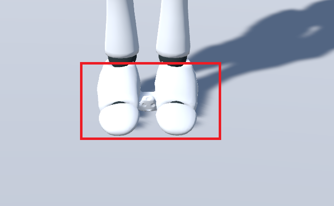

# Room Setup Using Only VIVE Tracker

In standard SteamVR room setup, both a headset and controllers are typically required. If the headset is unavailable, it can be simulated by modifying configuration files. However, if controllers are also absent, room setup cannot be completed as expected. In such cases, SteamVR defaults to using a base station as the origin of the tracking space, which can lead to significant limitations during use.

This guide introduces a method for performing room setup using only the VIVE Trackers and the Dollars VIVA program.

:::info Note

Although Dollars VIVA is a paid software, the features demonstrated in this guide are completely free to use.

You can download the latest version of Dollars VIVA here.

https://www.dollarsmocap.com/download

:::

## Simulating a Headset

Before starting the setup, you need to first simulate a headset. Please refer to the article below for detailed instructions.

https://vvvv.org/blog/2018/using-htc-vive-trackers-without-headset/

:::warning Note

When making the modifications mentioned in the article, please ensure that SteamVR is closed.

After completing the changes, restart SteamVR and check the modified file to confirm that the changes still remains.

If the modifications have been overwritten by SteamVR, you will need to make the changes again.

:::

Once the modification is successfully applied, you should see a hexagonal icon upon launching SteamVR.

Please note that when using a simulated headset, the room setup dialog will appear each time SteamVR is launched. You can safely ignore this prompt.

## Steps for Room Setup

Before starting the setup, you need to decide the origin point and orientation of the actor within the motion capture space.

Now, let us proceed with the room setup.

**1.** Close SteamVR.

**2.** Assuming Steam is installed in `C:\Program Files (x86)\Steam`, check if the file `chaperone_info.vrchap` exists in the directory `C:\Program Files (x86)\Steam\config\`. If the file is present, move it to another location for backup.

**3.** Open SteamVR and perform a room setup in standing mode. When prompted to enter the headset height, leave it at 0 and click **CALIBRATE FLOOR**. This step will regenerate a new `chaperone_info.vrchap` configuration file.

**4.** Turn on a VIVE Tracker and place it at the the origin point, as shown in the image below.

Ensure the green light on the Tracker(2.0) is facing the desired orientation of the actor. In the example, the edge where the monitor is located is used.

For the VIVE Tracker 3.0, the corner opposite the side with the green light should be facing the desired orientation.

**5.** Start VIVA. Once the white avatar appears, press **Y** and record the number displayed after Yaw.

**6.** Open the `chaperone_info.vrchap` file with a text editor. At the bottom of the file, locate the `yaw` field and enter the number you recorded earlier.

**7.** Close VIVA.

**8.** Restart SteamVR to apply the changes. If the Tracker is turned off at this point, keep it in the original position and power it on.

**9.** Launch VIVA again, press **Y**, and confirm that the Yaw value displayed on the screen is less than 0.1.

:::warning Note

If the Yaw value is greater than 0.1 at this step, we recommend performing a clean re-installation of SteamVR.

:::

**10.** Press **Y** to close the Yaw display, then press **U**. In the pop-up input box, enter the Yaw value from the previous step. Three numbers will appear below the input box, record these values.

**11.** Edit the `chaperone_info.vrchap` file and enter these values in the `translation` field above the `yaw` field.

**12.** Restart SteamVR. At this point, the tracking origin will be at the location of the VIVE Tracker, and the green light will indicate the tracking direction.

When you launch Dollars VIVA again, you will notice that the VIVE Tracker appears between the avatar's feet, at the origin of the tracking space.

