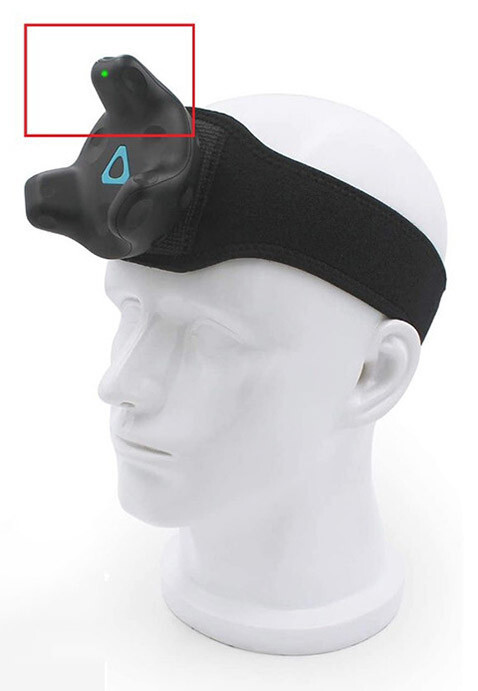

---
sidebar_position: 60
title: FAQ
slug: /viva-faq
---	

# FAQ

import TOCInline from '@theme/TOCInline';

<TOCInline toc={toc} />

## Finger Tracking Supports

Dollars VIVA natively supports finger tracking using Valve Index controllers.

You can also use motion capture gloves with Dollars VIVA, and integrate fingers and body within the engine, as well as DCC software.

You can see an example [here](/otherdevices).

## Mannequin Facing the Wrong Direction

The direction of the mannequin is determined by two factors:

1. SteamVR Orientation

2. Orientation of the Tracker on the Actor's Head

Please refer to the relevant documentation for more details.

## Unable to See the Trackers After Entering the Pre-Calibration Stage

If you cannot see the trackers after entering the pre-calibration stage, check the room setup, especially the floor height, to ensure everything is configured correctly.

## Multi-Person Motion Captures

Dollars VIVA primarily support single-person motion capture, but you can achieve multi-person motion capture by sharing base stations in the same area and setting up multiple computers.

This allows you to capture the movements of multiple individuals simultaneously within the shared tracking space.

## Valve Index Finger Tracking Does Not Work

Turn on all the controllers and make sure they are steadily visible in the SteamVR panel before opening Dollars VIVA.
