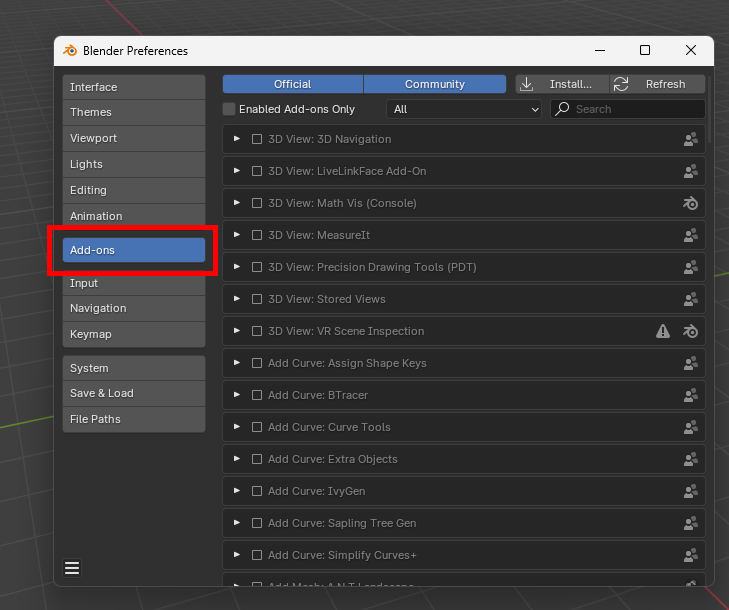
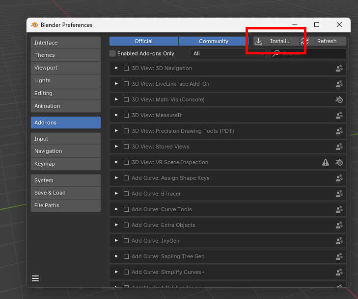
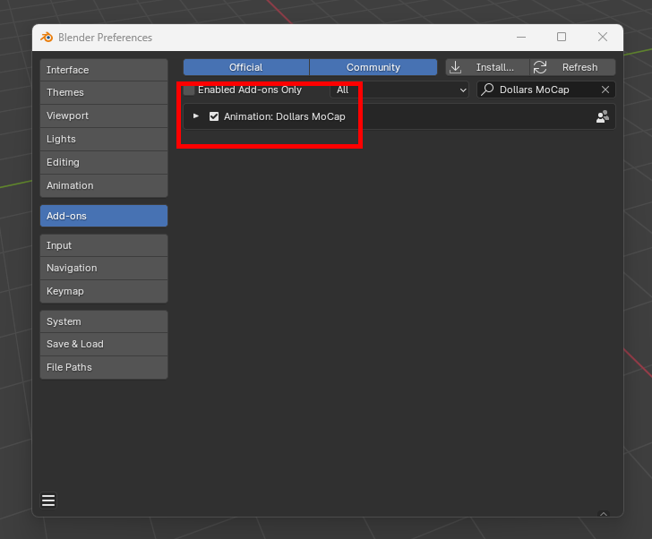
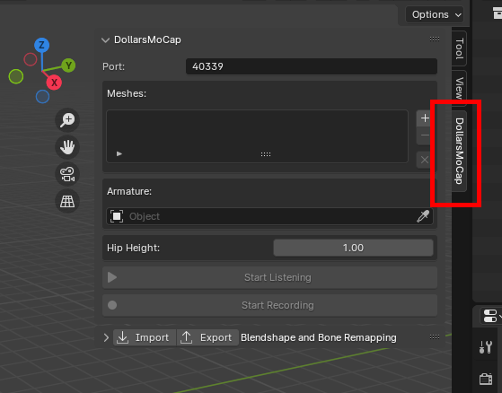
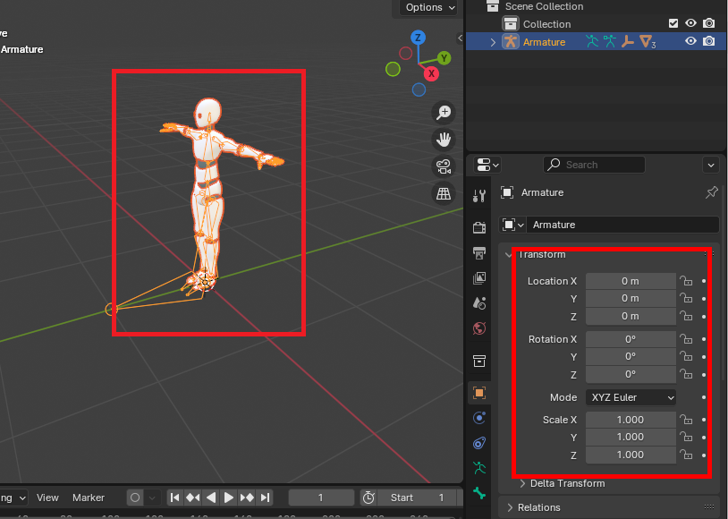
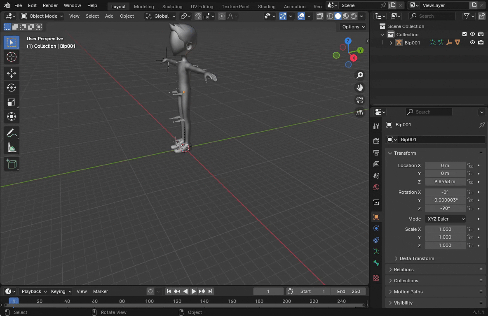
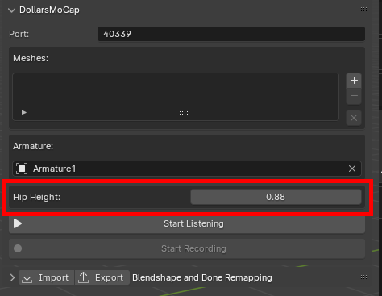
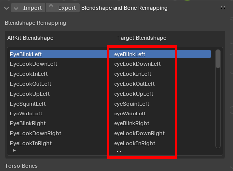
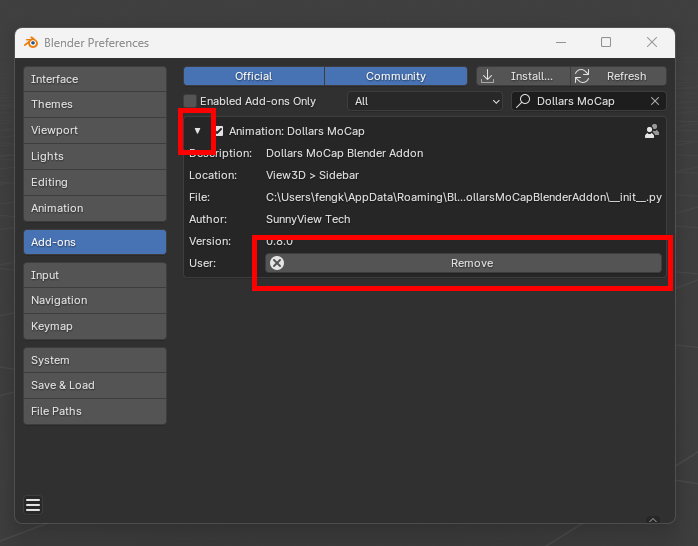

# Using the DollarsMoCap Plugin in Blender

:::info

The following Dollars MoCap products support native Blender plugin,

- Dollars MONO (since v.250522)

:::

:::warning Note
Recording is currently not supported in Blender 4.4.
:::

## Download and Installation

You can download the native DollarsMoCap Blender plugin from [the DollarsMoCap website](https://www.dollarsmocap.com/download).

After downloading (no need to unzip), install it in Blender's Preference Menu as follows,

**1.** Switch to the Add-ons tab.

**2.** Click Install in the upper right corner.

**3.** Select the downloaded zip file, install, and enable the add-on.s

Once installed, you will find the DollarsMoCap tab in Blender’s sidebar.

## Model Requirements{#models}

### Motion Capture

For motion capture, your model should meet the following requirements，

- **Armature Transform**
    - Location: (0, 0, 0)
    - Rotation: (0, 0, 0)
    - Scale: (1, 1, 1)
- **Armature Pose**
    - Standard T-Pose

#### Notes：

- **If the armature’s Location or Rotation is not (0, 0, 0)**

This may cause incorrect mocap results.

Before starting mocap, select the armature, then go to the Object menu and choose Apply > All Transforms to reset location and rotation.

- **If the armature’s Scale is not (1, 1, 1)**

This can cause abnormal hip motion.

After setting up the hip bone, you can manually adjust the Hip Height parameter to match the actual hip height (in meters).

### Facial Capture

For facial capture, your model should meet the following requirements,

- **Blendshape Naming**

It is recommended to use ARKit naming conventions for blendshapes.

- **Multi-Mesh Consistency**

If your model contains multiple face-related meshes, the blendshape names in each mesh must be consistent.

#### Notes：

If your blendshapes do not follow the ARKit naming convention, you can remap them in the plugin’s Blendshape Remapping panel.

## Uninstalling the Plugin

To uninstall the DollarsMoCap plugin, click the triangle icon on the left to expand the plugin details, then click Remove to uninstall.

