# Workflow

## Step-by-Step Guide

### 1. Start Blender Streaming

In the DollarsMoCap program, enable the Blender streaming. You can modify the port as needed.

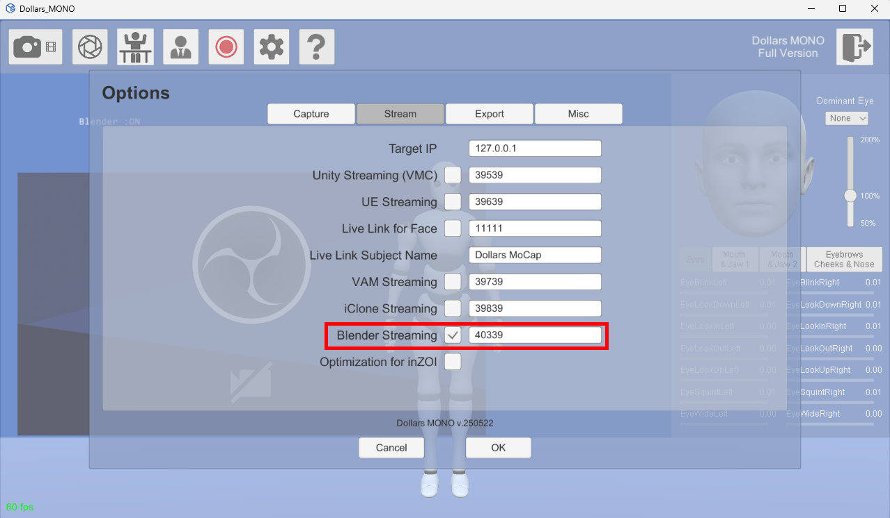

### 2. Import the Model

Import your model into Blender.

For specific model requirements, please refer to the [Model Requirements](/blender-addon#models) section.

### 3. Configure Facial Capture Meshes

In the Meshes list, add all the meshes used for facial capture.

#### 3.1 Click the "+" button to add a new mesh entry.

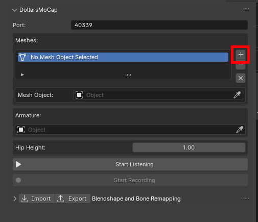

#### 3.2 In the newly added entry, select the corresponding mesh object.

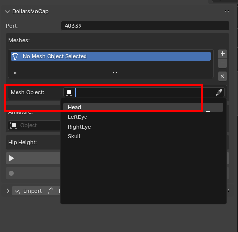

#### 3.3 If your model contains multiple facial meshes, repeat the above steps to add all of them.

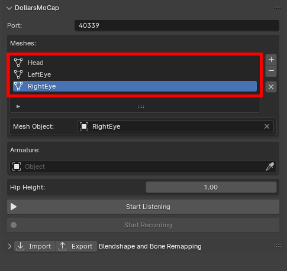

If your model's blendshapes do not use ARKit naming conventions, you can adjust the Target Blendshape names in the Blendshape Remapping panel.

### 4. Configure Motion Capture Armature

Select the armature of your model.

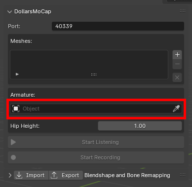

The addon will automatically match bones based on their names. You can also manually adjust the mapping in the Bone Remapping panel.

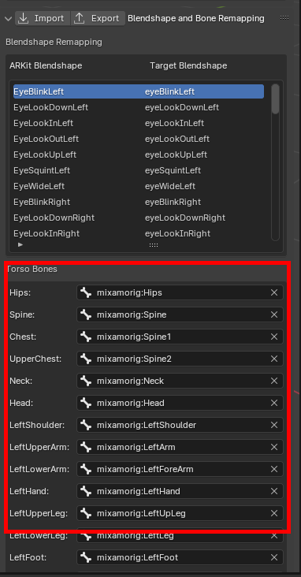

The addon will automatically detect the hip bone height, but you can manually edit this value (in meters) as needed.

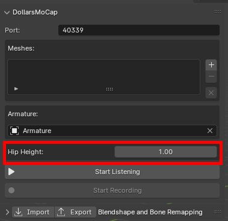

### 5. Connect and Preview in Real Time

Click Start Listening to establish a connection with the DollarsMoCap software and preview motion and facial capture results in real time.

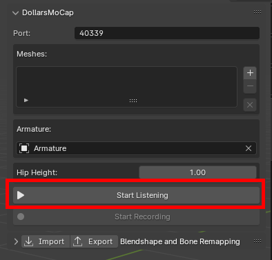

### 6. Record Capture Data

Click Start Recording to begin capturing and recording data.

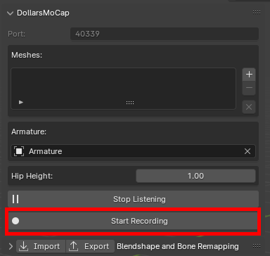

After recording, you will see the corresponding keyframes in the Blender Timeline.

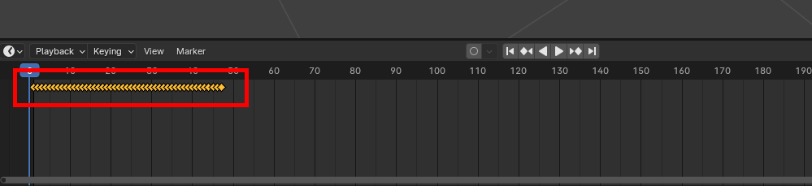

:::info Note
It is recommended to disconnect from the DollarsMoCap software before playing back recorded data.
:::

## Exporting and Importing Mapping Configurations

### Export Configuration

After setting up blendshape or bone mappings, click Export to save the current configuration for future use.

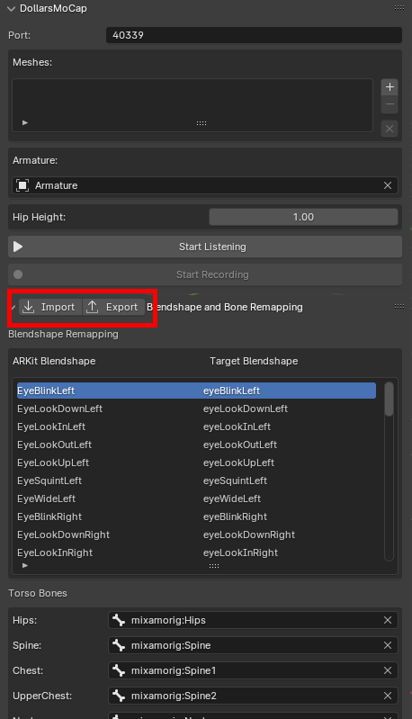

### Import Configuration

To reuse a previously saved configuration file, simply click Import and select the desired file. The mapping settings will be loaded automatically.

If you wish to import a bone mapping configuration, please ensure you have selected the target armature first to make sure the configuration is applied correctly to your model’s skeleton.
