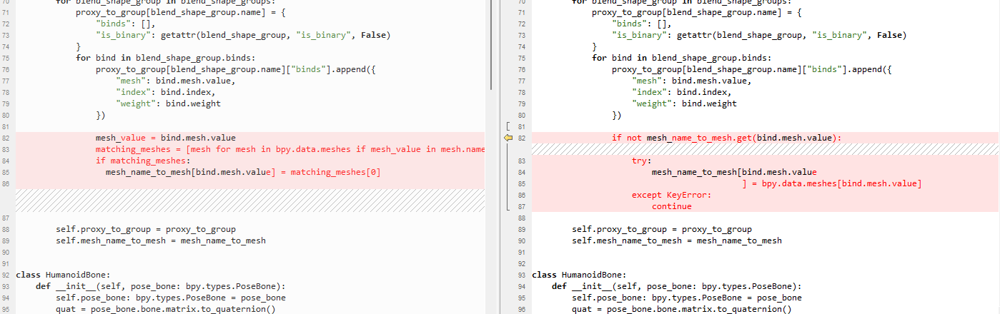
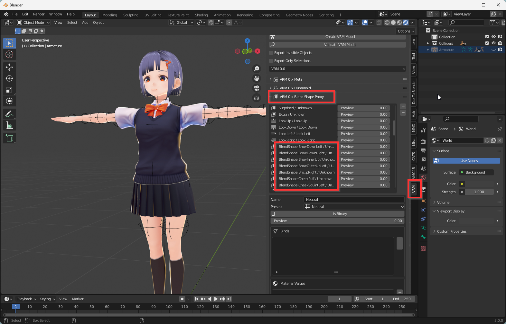
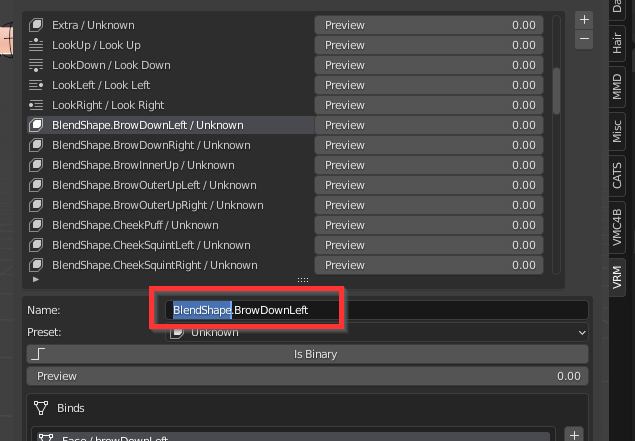
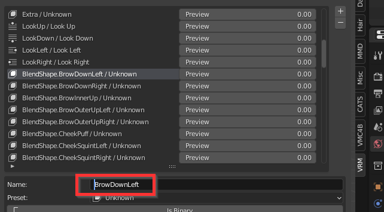
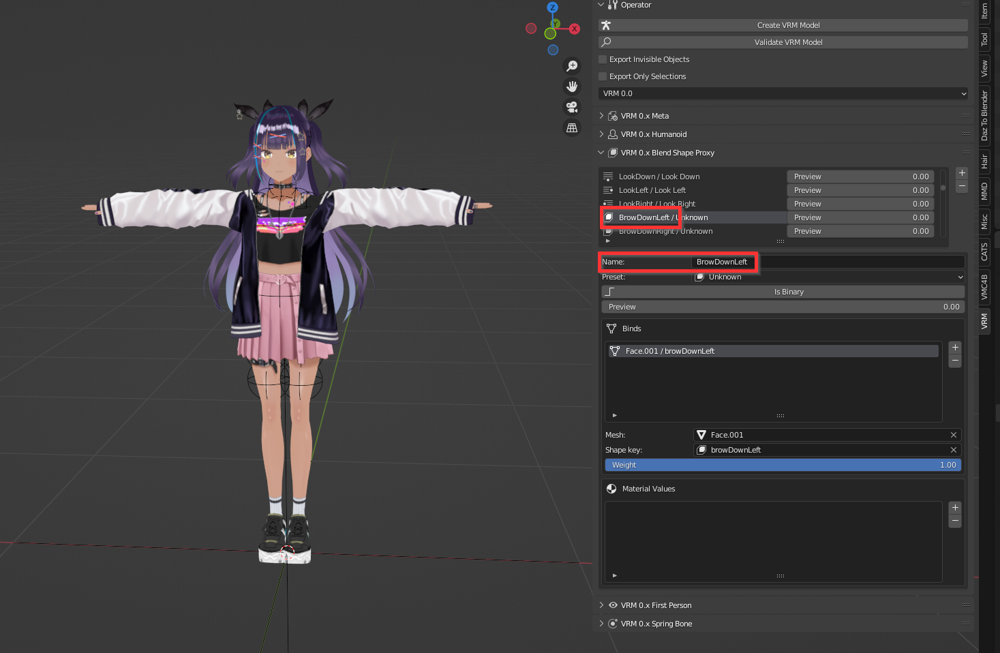

# Real-time Facial Capture for VRM Files

:::info Version used in this article
Blender 3.0.0

VRM Add-on for Blender 2.20.27，https://vrm-addon-for-blender.info/en/

VMC4B 1.1.0，https://booth.pm/en/items/3432915
:::

In Blender, real-time facial capture for VRM requires two steps: modifying the plug-in file and confirming the VRM Proxy, in addition to installing the plug-ins above.

## Modifying the plug-in file

- Find the directory where VMC4B is located.

Usually it is in C:\Users\\{username}\AppData\Roaming\Blender Foundation\Blender\3.0\scripts\addons\VMC4B.

- Download config.py from [here](https://kilimanjaro.sunnyview.tech/config.py) and overwrite the file with the same name in the core directory under VMC4B directory.

The difference between the two is as follows, the left side is modified.

## Confirming VRM Blend Shape Proxy

:::info
You need a VRM model that supports Perfect Sync for facial capture.
:::

- Import a VRM model and open the VRM plugin panel. In the Blend Shape Proxy column, find the blend shapes related to facial capture, and make sure the Name of each blend shape is of the following form.

EyeBlinkLeft  
EyeLookDownLeft  
EyeLookInLeft  
EyeLookOutLeft  
EyeLookUpLeft  
EyeSquintLeft  
EyeWideLeft  
EyeBlinkRight  
EyeLookDownRight  
EyeLookInRight  
EyeLookOutRight  
EyeLookUpRight  
EyeSquintRight  
EyeWideRight  
JawForward  
JawLeft  
JawRight  
JawOpen  
MouthClose  
MouthFunnel  
MouthPucker  
MouthLeft  
MouthRight  
MouthSmileLeft  
MouthSmileRight  
MouthFrownLeft  
MouthFrownRight  
MouthDimpleLeft  
MouthDimpleRight  
MouthStretchLeft  
MouthStretchRight  
MouthRollLower  
MouthRollUpper  
MouthShrugLower  
MouthShrugUpper  
MouthPressLeft  
MouthPressRight  
MouthLowerDownLeft  
MouthLowerDownRight  
MouthUpperUpLeft  
MouthUpperUpRight  
BrowDownLeft  
BrowDownRight  
BrowInnerUp  
BrowOuterUpLeft  
BrowOuterUpRight  
CheekPuff  
CheekSquintLeft  
CheekSquintRight  
NoseSneerLeft  
NoseSneerRight  
TongueOut  

- If not, make the change.

For example this VRM file, https://hub.vroid.com/en/characters/4525722107349736/models/6119522983111913549

Before,

After,

- After all changes are made, export the VRM.

- Load the new VRM and you can use VMC4B for facial capture.

- If the VRM Proxy is already in the above form, you can do facial capture directly.

For example this VRM file, https://hub.vroid.com/characters/7173430845109381047/models/6304450858378362082

