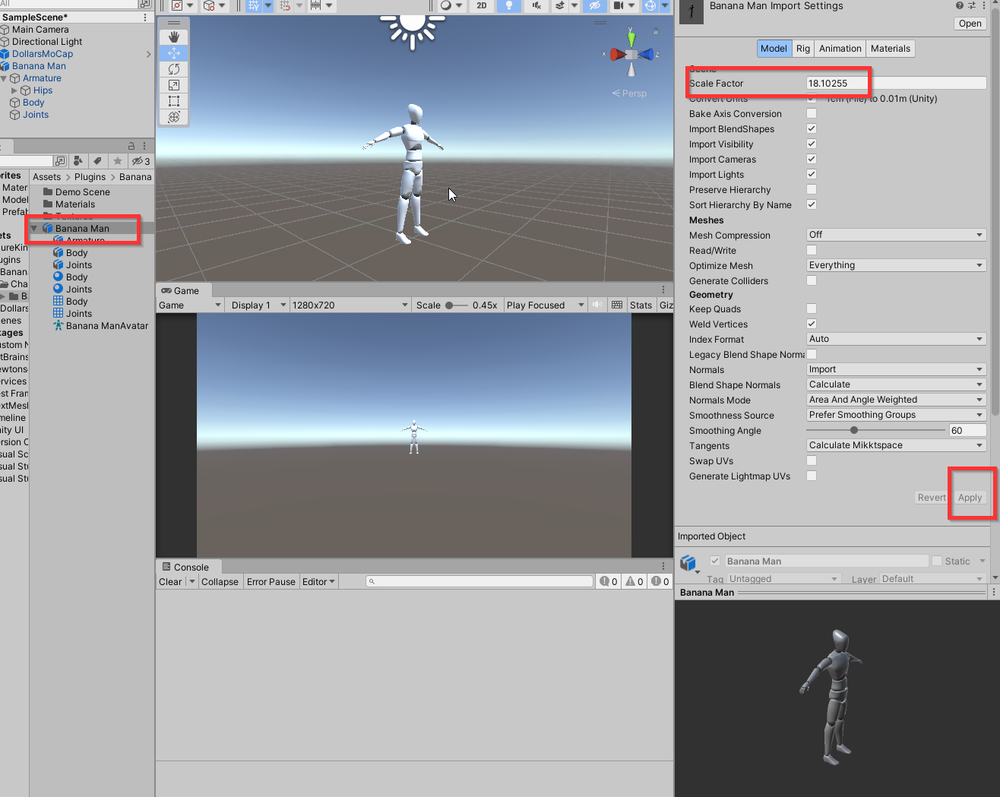

---
sidebar_position: 70
title: FAQ
slug: /unity-faq
---	

# FAQ

import TOCInline from '@theme/TOCInline';

<TOCInline toc={toc} />

## Character Floating in Unity Scenes

If you find that after moving a short distance in front of the camera, Dollars MONO has recognized your movement, but in the Unity scene, your character either does not move or moves a disproportionately long distance (as shown in the image below), this issue is usually caused by the scale of the Hips bone or its parent nodes not being set to 1.

For example, in the image below, the Scale of the Armature parent node of the Hips bone is 18.1.

In this case, we can change the Scale of the Armature to 1.

At the same time, in the model's Import Settings, change the Scale Factor to the earlier 18.1 and then Apply.

After making these adjustments, the character should move normally in the Unity scene.

## Face Capture Not Working

You can check the following,

- Ensure that the character's Blendshape is valid.
- Verify that the face capture mapping file is correctly set.
- Ensure there are no other components that might alter the Blendshape value (such as **VRMInstance**).

For **VRMInstance**, you can set its **Update Type** to **None**.

If you want to keep the Update for **VRMInstance**, set the **Update Type** to **Update**, and in the **Script Execution Order**, place **VRMInstance** before **FaceCapController** to ensure that Dollars MoCap face capture data is not overwritten.

