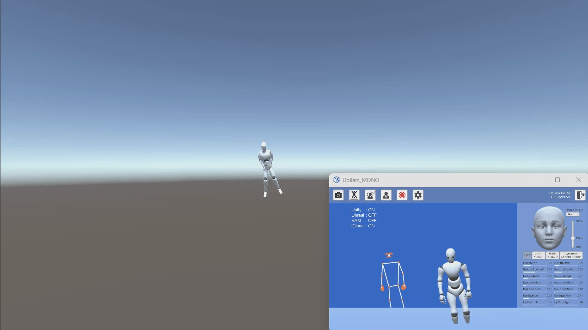
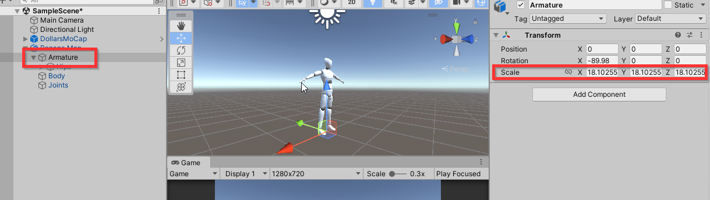
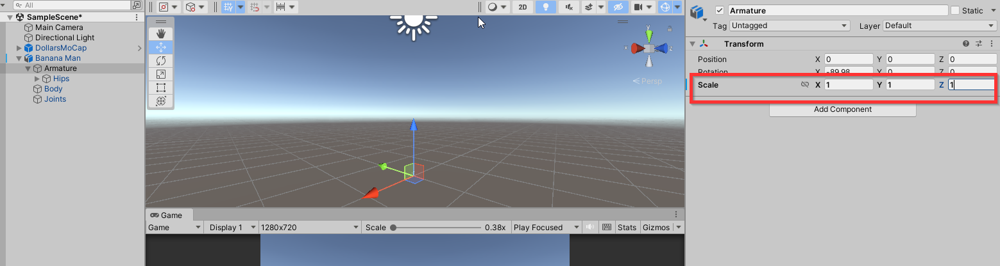
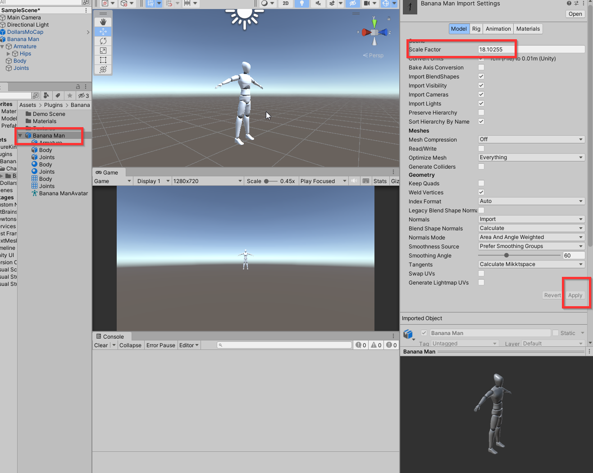

---
sidebar_position: 30
title: 📢 FAQ
slug: /unity-faq
---	

# FAQ

import TOCInline from '@theme/TOCInline';

<TOCInline toc={toc} />

## Character floating in Unity scene.

If you find that you have moved a short distance in front of the camera, and Dollars MONO has recognized your movement, but in the Unity scene, your virtual character does not move, or moves a long distance, as shown in the image below,

This is usually because the Scale of the Hips bone of the virtual character, or its parent nodes, is not set to 1.

For example, in the image below, the Scale of the Armature parent node of the Hips bone is 18.1.

In this case, we can change the Scale of the Armature to 1.

At the same time, in the model's Import Settings, change the Scale Factor to the earlier 18.1 and then Apply.

Afterwards, you will see that the virtual character can move normally.

