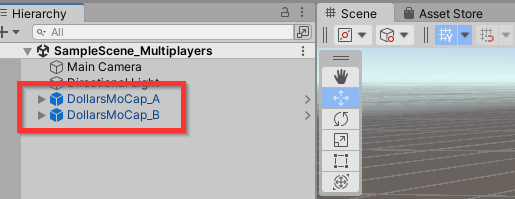
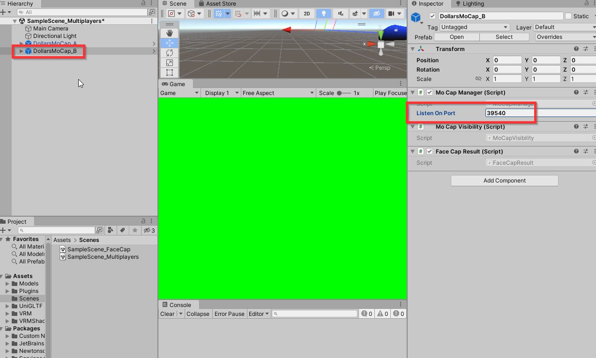
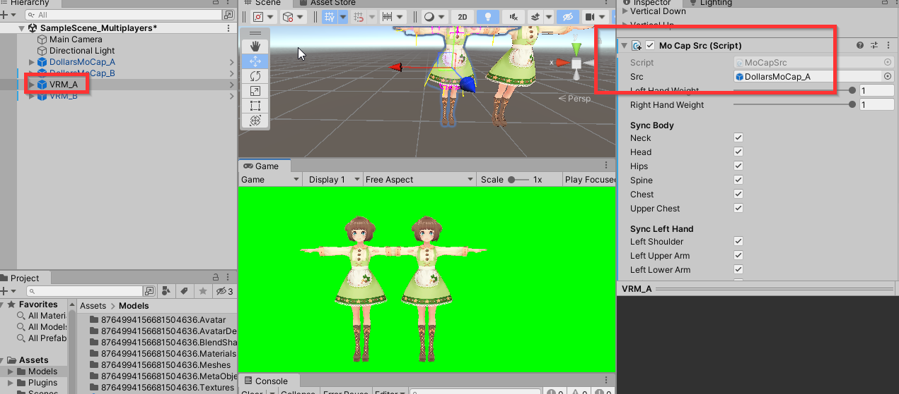
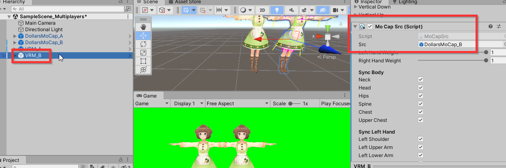

# Multi-person Motion Capture

You can run the Dollars MoCap program on multiple computers separately, and gather the motion capture results into the same Unity scene to achieve multi-character interaction.

## Setup

If you want to perform motion capture on Computer A (IP address 192.168.1.3) and Computer B (IP address 192.168.1.10) and combine the results in the Unity scene on Computer A, follow these steps,

### Ensure Connectivity

First, ensure that Computer B can ping Computer A using the `ping` command in the Command Prompt. If the ping is unsuccessful, check the firewall settings on both computers.

### Running Dollars MoCap

On Computer A, run the Dollars MoCap program as usual.

On Computer B, after running the Dollars MoCap program, open the options dialog box, enter the IP of Computer A (192.168.1.3) in the IP field, and change the Unity port to a number other than 39539, for example, 39540, as shown in the image below.

:::info

You can also run multiple instances of the Dollars MoCap program on the same computer.

In this case, keep the IP as the default local address, 127.0.0.1, and just make sure to set the Unity port numbers to different values for each instance.

:::

### Unity Scene Setup

In the Unity scene on Computer A, add two `DollarsMoCap` Prefabs.

For easy identification, name them respectively as `DollarsMoCap_A` and `DollarsMoCap_B`.

Select `DollarsMoCap_B` and modify the `Listen On Port` in its MoCap Manager component, filling in the port number 39540 that we just changed on Computer B.

### Character Setup

Add two humanoid models and name them `VRM_A` and `VRM_B`, respectively. Then, add the `MoCapSrc` component to each of them.

In the `MoCapSrc` component of `VRM_A`, assign `DollarsMoCap_A` as the motion capture source. This links the `VRM_A` model to receive motion capture data from the `DollarsMoCap_A` Prefab.

Similarly, in `VRM_B`, assign `DollarsMoCap_B` to the MoCapSrc component. This completes the setup.

Now both humanoid models, `VRM_A` and `VRM_B`, are configured to receive motion capture data from their respective sources.

You can download a sample Unity project with the above setup from the following link:

https://drive.google.com/u/0/uc?id=1Rd3Orx3LnAw8vcGqH3B9VB57bOHYD8eK&export=download
