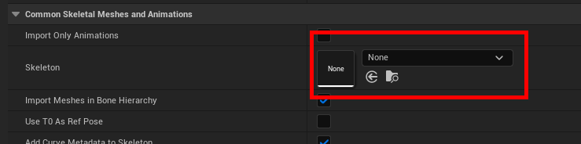
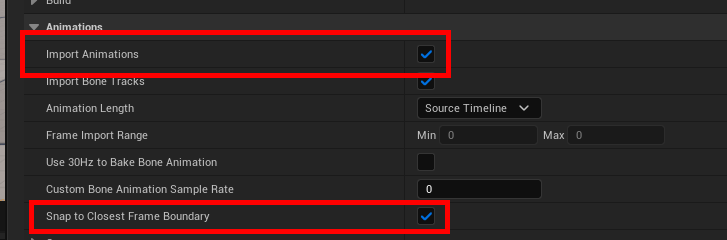
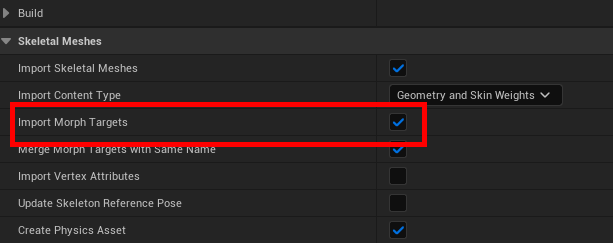

# Importing FBX

When importing Dollars MoCap FBX files into Unreal Engine, please note the following.

## Skeleton Selection

If this is the first time importing a Dollars animation into the project, leave the Skeleton field empty so that the engine generates a new skeleton asset automatically.

If you have already imported Dollars animations into the project before, you may select the previously generated skeleton for reuse.

Note that Dollars body animations and facial animations use different skeletons. Do not mix them.

## Animation Import Options

Enable Import Animations, and Snap to Closest Frame Boundary.

## Additional Settings for Facial Animation

If you are importing facial animation, also enable Import Morph Targets.

